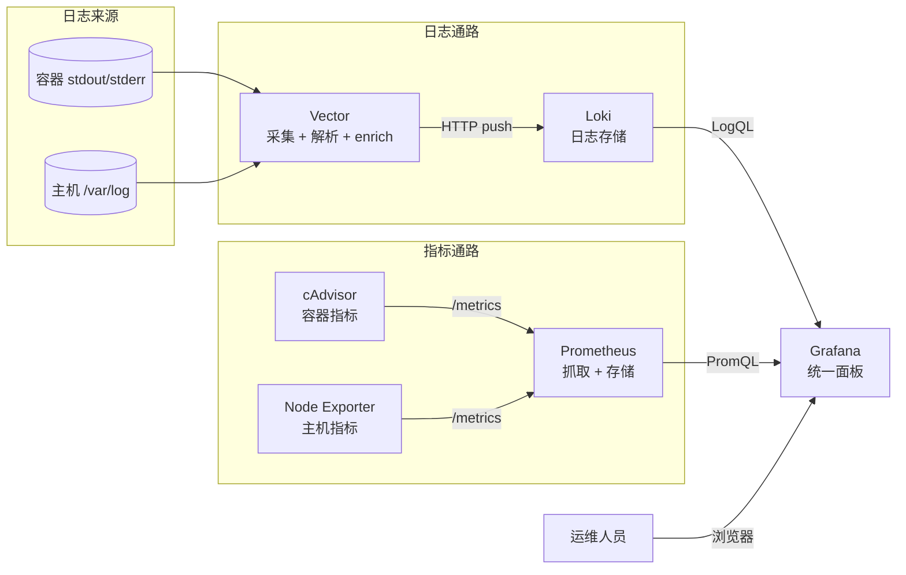

# 监控栈前置知识与背景

为 Zata 下游 VPS 部署一套完整的容器化监控栈(Vector / Loki / cAdvisor /
Node Exporter / Prometheus / Grafana)需要的前置背景、概念解释、与 zata-ops
现有架构的衔接说明。

本文是临时草稿,落地实施后归档或删除。

---

## 一、为什么是这套组合

### 1.1 痛点

在 Zata 的典型下游项目里,业务跑在 Docker Compose 上,宿主是单台 VPS。
一旦线上出问题,会同时面对三件事:

1. **日志散落**:N 个容器各自的 stdout/stderr,没有聚合入口
2. **指标缺失**:CPU/内存/磁盘只能 `docker stats` 看实时快照,没有历史曲线
3. **故障定位难**:错误是日志里的,但触发它的是资源指标,缺一个把两者并排看的工具

需要的是一个统一的"运维仪表盘",覆盖日志 + 指标两条线。

### 1.2 三种主流方案对比

| 方案 | 组成 | 优点 | 缺点 |
|---|---|---|---|
| **ELK** | Elasticsearch + Logstash + Kibana | 全文索引强、生态成熟 | ES 重(>=4GB RAM)、运维成本高 |
| **EFK** | Elasticsearch + Fluentd + Kibana | 同上 | 同上 |
| **Loki + Prom + Grafana**(本次选型) | Loki + Prometheus + Grafana + Vector + exporters | 极轻、标签索引而非全文、复用 Grafana | 全文检索弱、需要 PromQL + LogQL 双语言 |

选 Loki 体系的核心理由:**单 VPS 资源有限**。ES 在 <8GB RAM 的机器上基本
跑不动,而 Loki 的"只索引 label、不索引全文"哲学让单进程模式可以在
512MB 内存下扛住日均 GB 级别的日志量。

### 1.3 可观测性三大支柱

业界把可观测性分成三类信号:

- **Logs(事件流)**:离散事件,带时间戳,例如 "用户 X 下单失败"
- **Metrics(数值时序)**:周期性数值,例如 "CPU 使用率 73%"
- **Traces(请求链路)**:单个请求跨服务的完整路径

本次只覆盖 Logs + Metrics。Trace(Jaeger / Tempo)属于另一层投入,
不在本次范围内。

---

## 二、整体架构

两条独立数据通路,Grafana 在中间把它们并排展示:



关键设计原则:

1. **通路解耦**:日志和指标走不同的存储和查询语言
   (LogQL / PromQL),互不影响
2. **单一展示层**:Grafana 同时接 Loki 和 Prometheus,
   面板可以"上排日志下排指标"
3. **Pull > Push**(指标侧):Prometheus 主动抓 exporters,
   exporters 不需要知道 Prometheus 在哪
4. **Pull > Push**(日志侧反向):容器自己往 docker.sock 写,
   Vector 主动去拉,由 Vector 决定解析和路由

---

## 三、Docker 日志是怎么"流"出来的

这一节是理解 Vector 工作方式的基础。

### 3.1 容器的 stdout/stderr 去了哪

每个容器运行时把进程的标准输出和标准错误打印到自己的伪终端 PTY。
Docker daemon 接管这些数据流,根据配置的 **logging driver** 写到目的地:

```
容器进程 stdout/stderr
        |
        v
Docker daemon (containerd-shim)
        |
        v
logging driver (默认 json-file)
        |
        v
/var/lib/docker/containers/<container-id>/<container-id>-json.log
```

默认 `json-file` driver 把每一行日志包成 JSON:

```json
{"log": "User 42 logged in\n", "stream": "stdout", "time": "2026-06-11T..."}
```

`docker logs <container>` 实际就是读这个文件解析后输出。

### 3.2 容器日志的"身份信息"在哪

光有日志内容不够,还需要知道"这是哪个容器、哪个服务、哪个 compose 项目
输出的"——这些维度是 Loki label 的来源。

Docker 把这些维度放在容器 **labels** 和 **env** 里:

- `com.docker.compose.project=my-app`
- `com.docker.compose.service=backend`
- `com.docker.compose.container-number=1`

Vector 通过 docker.sock 的 `/containers/json` API 拿到这些,
作为 label 加到每条日志上。这就是为什么 **Vector 必须挂 docker.sock**。

### 3.3 为什么不让容器直接推给 Loki

理论上可以让 Docker daemon 用 `loki` logging driver,
每个容器日志直接打到 Loki。看起来更简单,但有两个问题:

1. **Loki driver 不解析日志**:业务日志往往是 JSON 或非结构化文本,
   需要解析后才能作为 label(HTTP status / error level)查询
2. **没办法过滤和路由**:监控容器自己的日志会自我回流,
   业务日志和系统日志的保留策略应该不同

Vector 作为中间层解决这两个问题。

---

## 四、指标采集:Pull 模型的哲学

### 4.1 Push vs Pull

| 模式 | 代表 | 数据流 |
|---|---|---|
| **Push** | StatsD / InfluxDB | 客户端 -> 主动 -> 采集器 |
| **Pull**(本次) | Prometheus | 采集器 -> 主动 -> 客户端 |

Prometheus 选了 Pull,理由:

- **服务发现**:Prometheus 自己决定"现在该抓谁",
  新增一个 exporter 不需要业务改代码
- **健康检查**:scrape 本身是一种心跳——抓不到 = 该实例挂了
- **多采集器**:可以被多个 Prometheus 同时抓,
  做 HA 或者异地复制

代价是每个 exporter 必须暴露一个 HTTP `/metrics` 端点。

### 4.2 scrape 间隔

Prometheus 配置里有:

```yaml
global:
  scrape_interval: 15s     # 每 15 秒抓一次
  evaluation_interval: 15s # 每 15 秒评估一次告警规则
```

15 秒是平衡值。生产中常见 10s(高灵敏度)/ 30s(低开销)。
更短的间隔 = 更精细的曲线 = 更多的存储。

### 4.3 exporters 不是"采集器"

命名容易误导:Node Exporter 名字里有 Exporter,但它是**被采集方**。
它的工作只是把当前主机状态转成 Prometheus 看得懂的文本格式:

```
# HELP node_cpu_seconds_total Seconds the CPUs spent in each mode.
# TYPE node_cpu_seconds_total counter
node_cpu_seconds_total{cpu="0",mode="idle"} 12345.67
node_cpu_seconds_total{cpu="0",mode="user"} 234.56
...
```

Prometheus 才是真正的"采集器"。这一点新手最容易搞混。

---

## 五、时序数据的特点

Logs 和 Metrics 底层都是时序数据,但存储需求差异很大。

### 5.1 Metrics 的存储特征

- **写入高频、定时**:scrape_interval x 抓取目标数 = 每秒写入量
- **数值聚合**:查询经常是 sum/rate/avg over a range
- **降采样**:90 天前的数据用 5 分钟精度足够,不必保留秒级

Prometheus 的 TSDB(时序数据库)就是为这个场景设计的:
把数据按 2 小时分块(block),老的 block 自动压缩降采样,
超过保留期的整块删除。

### 5.2 Label cardinality 是头号陷阱

每条时序 = 一组 label 值的组合。每个不同组合就是一条独立时序。

> **绝对不要把容器 ID、请求 ID、用户 ID、IP 地址放进 label。**

例如一个 label `container_id="abc123..."`:
- 每起一个容器 = 一条新时序
- 容器销毁后老时序成了"幽灵数据",占用存储但不更新
- 1000 个容器生命周期过后 = 100 万条死时序

正确做法:把容器 ID 当**业务字段**(在 Grafana 里查的时候作为过滤项),
label 只用**有限集合**:`compose_service`、`compose_project`、`stream`。

### 5.3 Logs 的存储特征

- **写入突发**:流量高峰时集中爆发,平时很闲
- **全文 vs 标签**:Loki 只索引 label,全文靠 grep("contains")
- **不更新**:日志写进去就不改

Loki 选的策略:
- label 索引走 BoltDB(嵌入式 KV),保持轻量
- 原始日志按 chunk 切成文件块,按时间段轮转
- 旧 chunk 用 compactor 压缩、过期删除

代价是**全文检索能力弱**——你不能像 ES 那样高亮命中片段,
只能说"在某段时间内某 label 集合下包含某关键字的行"。

对运维场景够用。如果需要做用户行为分析、客服搜索,
那是 ELK 的场景,不是 Loki 的场景。

---

## 六、Loki 的设计哲学

### 6.1 "Prometheus for logs"

Loki 的灵感直接来自 Prometheus:
- 同样的 label 维度模型
- 同样的 pull/scrape 心智(只是 Loki 反过来,让 Promtail / Vector push)
- 同样的单进程模式可以跑通所有角色

### 6.2 三种进程角色

Loki 单二进制内可以跑三种角色,单机模式下全跑:

```
+-------------+
| Distributor | 接 HTTP 请求,写入一致性哈希环
+------+------+
       |
+------v------+
|   Ingester  | 把 chunk 写到本地文件系统
+------+------+
       |
+------v------+
|   Querier   | 处理查询,从 ingester + 旧 chunk 拉数据
+-------------+
```

Compactor 是后台进程,定期合并老 chunk、清理过期数据。

单 VPS 上这一切都在一个容器里。不要被多进程的术语吓住。

### 6.3 schema 版本

Loki 历史上用过几种 schema:

- `v11` (BoltDB-shipper + chunk store):老版本,运维负担重
- `tsdb`(2023+ 默认):单文件 TSDB,简化部署
- `tsdb-s3` / `tsdb-gcs`:云存储后端(本次不用)

**本次用 `tsdb`**。这是当前 Loki 官方推荐的单机模式 schema。

---

## 七、Vector 的角色

### 7.1 定位:日志 ETL

Vector 不是一个"日志存储",它做的是采集 -> 转换 -> 输出(ETL)。
可以理解为日志领域的 Logstash,但更轻、更快(Rust 写的)。

### 7.2 一个 Vector 配置长什么样

```yaml
sources:
  docker_sock:
    type: docker_logs
    include_images_glob: ["myapp/*", "*/app-*"]  # 排除自己这堆监控容器

transforms:
  parse_json:
    type: remap
    inputs: [docker_sock]
    source: |
      . |= parse_json!(.message)
      .level = .level || "info"

sinks:
  to_loki:
    type: loki
    inputs: [parse_json]
    endpoint: http://loki:3100
    labels:
      compose_service: "{{ fields.com_docker_compose_service }}"
      compose_project: "{{ fields.com_docker_compose_project }}"
```

三段式:

- `sources` 决定从哪拿数据
- `transforms` 用 VRL(Vector Remap Language)改写
- `sinks` 决定发到哪

### 7.3 为什么不用更简单的方案

| 方案 | 适合 | 不适合 |
|---|---|---|
| **直接挂 docker.sock 给 Loki 的 loki driver** | 极简 demo | 没法解析、过滤、路由 |
| **Loki 自带 Promtail** | 只想跑 Loki | 跟现有 ELK 经验差异大 |
| **Fluent Bit** | 成熟生态 | 配置繁琐、YAML 不直观 |
| **Vector**(本次) | 灵活、可读、高性能 | 学习 VRL |

VRL 是这次唯一需要新学的小语言。它的核心只有十几条语句,
够用就行,不必精通。

---

## 八、Grafana 的定位

Grafana 只做一件事:**把数据源画成图**。它不存储任何业务数据,
所有查询转发给后端数据源(Prometheus / Loki / MySQL / 任何带 plugin 的东西)。

### 8.1 Provisioning

Grafana 支持把数据源和面板通过配置文件"自动注入":

```
grafana/
└── provisioning/
    ├── datasources/
    │   └── datasources.yml   # 自动注册 Prometheus + Loki
    └── dashboards/
        └── default.yml       # 自动从本地目录加载 JSON 面板
```

好处:

1. 全新部署的 Grafana 启动后**立刻有数据源和默认面板**,不用手动点
2. 团队成员换设备登录看到的是同一套面板,没有"我这边有图你那边没有"的问题
3. 面板 JSON 可以进 git review

### 8.2 Dashboard as Code 的边界

Grafana provisioning 适合"启动时把一批面板放上去",但**不适合**:
面板迭代开发(应该用 UI 编辑后导出 JSON 回 git)。

本次的策略:
- 启动时通过 provisioning 注入 3-5 个核心面板(Node Exporter Full、Docker Containers、自定义业务面板)
- 迭代调整通过 UI 编辑 -> 导出 JSON -> 提交

---

## 九、各组件深入

### 9.1 cAdvisor

- **来源**:Google 开源,Kubernetes 内置使用
- **暴露**:`:8080/metrics`(容器级 CPU/内存/网络/磁盘 IO)
- **限制**:不感知限制(cgroup limit)和实际使用之间的差异需要自己算
- **资源**:常驻 ~100MB RAM,但 scrape 时会短暂涨到 ~300MB

### 9.2 Node Exporter

- **来源**:Prometheus 官方
- **暴露**:`:9100/metrics`(主机级 CPU/内存/磁盘/网络/内核参数)
- **设计哲学**:**只读** `/proc`、`/sys`、`syscall`,不调用任何外部命令
- **安全**:1.7+ 默认监听所有接口,生产应该用 `--web.listen-address=127.0.0.1:9100`
  并通过 internal 网络给 Prometheus 抓

### 9.3 Prometheus

- **核心**:scrape -> TSDB 写入 -> PromQL 查询 -> alert rule 评估
- **单实例够用场景**:< 1M active series(本次远低于)
- **关键参数**:
  - `--storage.tsdb.path=/prometheus`
  - `--storage.tsdb.retention.time=30d`
  - `--storage.tsdb.retention.size=10GB`(双保险,防止磁盘写满)
  - `--web.enable-lifecycle`(支持 `POST /-/reload` 热加载配置)
- **不要做的事**:远程写(remote_write)到外部——单 VPS 没必要

### 9.4 Loki

- **最新稳定版**:2.9.x(截至 2026-06)
- **关键配置**:
  ```yaml
  common:
    storage:
      filesystem:
        chunks_directory: /loki/chunks
        rules_directory: /loki/rules
  schema_config:
    configs:
      - from: 2024-01-01
        store: tsdb
        object_store: filesystem
        schema: v13
        index:
          prefix: index_
          period: 24h
  limits_config:
    retention_period: 168h  # 7 天
  ```
- **资源**:日均 1GB 日志大约消耗 200MB RAM + 1GB 磁盘

### 9.5 Vector

- **镜像**:`timberio/vector:0.X-alpine`,< 100MB
- **配置挂载**:建议 ConfigMap 风格(文件挂载进容器)
- **热重载**:支持 `SIGHUP` 或 `vector validate` 命令

### 9.6 Grafana

- **插件市场**:默认带 Prometheus 和 Loki 数据源 plugin
- **推荐面板源**:
  - [Node Exporter Full](https://grafana.com/grafana/dashboards/1860) (community)
  - [Docker Container/Host](https://grafana.com/grafana/dashboards/893) (community)
  - 自建业务面板

---

## 十、和 zata-ops 现有架构的关系

### 10.1 复用 Traefik 网络

`deploy/vps-traefik/` 已经建立了一个名为 `traefik` 的 external Docker 网络。
所有暴露公网的服务都加进去,让 host-level Traefik 统一接 HTTPS。

本次监控栈的 `grafana` 服务**复用同一网络**:

```yaml
services:
  grafana:
    networks:
      - traefik
      - monitoring  # 内部网络,给 prometheus/loki/vector 用
    labels:
      - "traefik.enable=true"
      - "traefik.http.routers.grafana.rule=Host(`grafana.example.com`)"
      - "traefik.http.routers.grafana.tls.certresolver=letsencrypt"
```

### 10.2 不在 zata-ops `db backup` 范围内

zata-ops 的 `db backup` 只备份业务数据库 + 业务日志 + 业务资源。
监控数据(Prometheus TSDB、Loki chunks)**不归它管**——保留策略、
备份策略都不一样。

明确边界:
- 业务数据 -> S3 via `db backup`
- 监控数据 -> 本地磁盘 + 单独的 retention,**监控数据丢失不影响业务**

### 10.3 通过 `env provision --with-monitoring` 接入

`deploy/vps-traefik/install-docker-traefik.sh` 完成 Traefik 部署后,
新增可选步骤:拉 `deploy/monitoring/` 到 `/opt/apps/monitoring`,
跑 `docker compose up -d`。

加 `--with-monitoring` flag 才执行,不传则跳过——不是所有 VPS 都需要监控。

### 10.4 凭据边界

- `.env` 里的 `GF_ADMIN_PASSWORD` 是 Grafana admin
- Prometheu / Loki **不暴露公网**,不走 `.env`,走 internal 网络
- Vector 读 docker.sock 是只读挂载,避免恶意日志改写容器配置

---

## 十一、常见踩坑

按踩坑频率排序:

### 11.1 容器 ID 当 label 引发 cardinality 爆炸

如果 Vector 把 `container_id` 或者 `container_name`(容器名每次重启会变)当 label,
每重启一次就多一组 label 组合,TSDB 几小时就撑爆。

**对策**:label 只用 `compose_service`、`compose_project`、`stream`。
容器名作为业务字段存储在日志内容里,需要时用 `|~ "<name>"` 过滤。

### 11.2 监控容器自己被 Vector 采集

如果 Vector 不带 `include_images_glob` 过滤,grafana / prometheus / loki 自己的
容器日志也会进 Loki,造成自循环和噪音。

**对策**:在 Vector 配置里 `exclude` 掉所有 `monitoring/*` 镜像。

### 11.3 时区问题

Docker 容器默认 UTC。Loki 和 Prometheus 都按容器时间戳存,
Grafana 面板按浏览器时区显示。如果业务日志里打印的是本地时间戳(`2026-06-11 18:00:00`),
Loki 可能解析错位。

**对策**:

- 容器统一设 `TZ=Asia/Shanghai`(环境变量)
- Vector 用 VRL 解析时间戳时显式带时区

### 11.4 磁盘爆

最常见的事故。

- Prometheus TSDB 没设 `--storage.tsdb.retention.size=10GB`,磁盘满后整个挂掉
- Loki chunks 没设 `retention_period`,磁盘满后写入失败但不告警
- Vector 写本地 buffer(默认 `data_dir`)会撑爆

**对策**:所有数据卷用 `monitoring-` 前缀,方便 `du -sh /var/lib/docker/volumes/monitoring-*`
统一观察。

### 11.5 docker.sock 暴露的安全边界

把 `/var/run/docker.sock` 挂给 Vector 是**必要的**。但这等价于给了 Vector
"控制所有容器"的能力。

**对策**:

- 只读挂载:`:ro`
- Vector 跑在 dedicated user 下(镜像默认是非 root)
- 不让 Vector 容器跑其他工作负载(避免被入侵后横向)

### 11.6 high-cardinality 业务日志

业务日志里如果带 `user_id`、`request_id`、`session_id`,又被当作 Loki label,
同样会撑爆。

**对策**:业务日志里这些字段**留在 message 里**,Vector 解析后作为 JSON 字段
存进日志内容,用 `{compose_service="api"} | json | user_id="42"` 查。

### 11.7 scrape 超时导致数据缺口

Prometheus 默认 scrape_timeout = 10s。如果某个 exporter 卡住,
Prometheus 会标记 `up=0` 但不影响其他抓取任务。

但如果 scrape_interval < scrape_timeout,会出现连续抓取堆积,
内存涨。

**对策**:scrape_interval >= scrape_timeout,一般 15s scrape + 10s timeout 是安全值。

---

## 十二、推荐阅读

不需要从头读,挑感兴趣的看:

- **Vector**:[Vector 官方文档 - Concepts](https://vector.dev/docs/about/under-the-hood/) —— 30 分钟理解 sources/transforms/sinks 模型
- **Loki**:[Loki Architecture](https://grafana.com/docs/loki/latest/fundamentals/architecture/) —— 单进程模式章节
- **Prometheus**:[Prometheus Concepts](https://prometheus.io/docs/concepts/data_model/) —— 数据模型和 label
- **Grafana**:[Provisioning Grafana](https://grafana.com/docs/grafana/latest/administration/provisioning/) —— datasources 和 dashboards 自动加载
- **PromQL**:[Query Basics](https://prometheus.io/docs/prometheus/latest/querying/basics/) —— 必学,30 分钟入门
- **LogQL**:[LogQL Syntax](https://grafana.com/docs/loki/latest/query/) —— 与 PromQL 高度相似

---

## 十三、下一步

读完这份背景,进入实际部署。预期产出物:

1. `deploy/monitoring/` 目录(compose + 配置 + provisioning 文件)
2. `deploy/vps-traefik/install-docker-traefik.sh` 增加 `--with-monitoring` 分支
3. `docs/architecture/monitoring-stack.md` 正式文档(这份草稿归档进 archive 或删除)
4. README 增加"监控栈部署"章节链接

建议落地顺序:
1. 先在本地 docker compose up 跑通,验证基础数据流通
2. 再接到 Traefik 网络,验证域名 + HTTPS
3. 最后接入 `env provision` 流程
