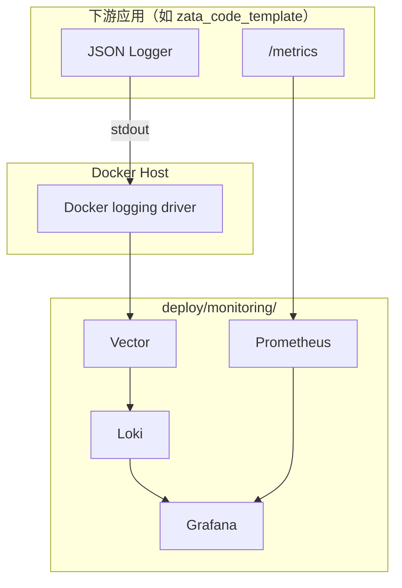

# 监控栈：Vector + Loki + Prometheus + Grafana

本文档描述 zata-ops 提供的单机 VPS 可观测性栈：如何部署、如何与下游应用对接、如何排查常见问题。

## 架构



## 组件

| 组件 | 用途 | 默认端口 |
|---|---|---|
| Vector | 采集 Docker 容器 stdout，解析 JSON，推送 Loki | 8686 |
| Loki | 日志存储与查询 | 3100 |
| Prometheus | 抓取 `/metrics` 和 Vector 指标 | 9090 |
| Grafana | 统一面板，自动 provisioning 数据源 | 3000 |

## 部署

### 随 VPS 一起部署

```bash
zata-ops env provision \
  --host your-server.example.com \
  --user root \
  --profile vps-traefik \
  --acme-email ops@example.com \
  --with-monitoring \
  --monitoring-domain example.com
```

### 手动部署

```bash
cd deploy/monitoring
cp .env.example .env
# 编辑 .env，填写 DOMAIN 和 TRAEFIK_NETWORK
vim .env
docker compose up -d
```

### 本地验证（无 Traefik）

本地联调时可以临时绕过 Traefik，直接暴露 Grafana 端口：

```bash
cd deploy/monitoring
cp .env.example .env
# DOMAIN 可保留 localhost，仅影响 Grafana 的 root_url
docker network create traefik  # 若不存在
# 临时添加端口映射到 docker-compose.override.yml
cat > docker-compose.override.yml <<'EOF'
services:
  grafana:
    ports:
      - "3000:3000"
  prometheus:
    ports:
      - "9090:9090"
  loki:
    ports:
      - "3100:3100"
EOF
docker compose up -d
```

验证完成后删除 `docker-compose.override.yml`，不要提交到版本库。

## 与下游应用对接

下游应用需要满足三个约定：

1. **JSON 日志到 stdout**：应用日志为 JSON，包含 `service_name`、`level`、`message` 等字段。
2. **`/metrics` 端点**：暴露 Prometheus 格式的 RED 指标。
3. **Docker Compose 标签**：服务需带以下标签，供 Vector 分组：
   - `com.docker.compose.project=<project>`
   - `com.docker.compose.service=<service>`

以 `zata_code_template` 为例，其 `config.toml` 已提供 `[observability]` 开关，Docker Compose 服务也已打上所需标签。详见 `zata_code_template/docs/guides/observability.md`。

## 使用 Grafana

部署完成后，Grafana 通过 Traefik 暴露：

```text
https://grafana.<DOMAIN>
```

默认已注册两个数据源：

- **Prometheus**：查询 RED 指标。
- **Loki**：查询应用日志。

默认面板：

- **RED Metrics**：请求量、错误率、P99 延迟。
- **Application Logs**：日志浏览，支持按 `request_id` 过滤。

## Loki 查询示例

```logql
# 查询某个服务的所有日志
{compose_service="backend"}

# 查询具体请求的日志
{compose_service="backend"} |= "abc123"

# 查询 ERROR 级别日志
{compose_service="backend", level="error"}
```

## Prometheus 查询示例

```promql
# 请求速率
sum(rate(http_requests_total[5m])) by (path)

# 错误率
sum(rate(http_requests_total{status=~"5.."}[5m]))
/
sum(rate(http_requests_total[5m]))

# P99 延迟
histogram_quantile(0.99,
  sum by (le, path) (rate(http_request_duration_seconds_bucket[5m]))
)
```

## 常见问题

### Grafana 看不到数据源

检查 `deploy/monitoring/grafana/provisioning/` 是否正确挂载到 `/etc/grafana/provisioning/`，且文件扩展名为 `.yaml`。

### Loki 查不到日志

1. 检查 Vector 日志是否有 parse error。
2. 确认 Vector 正确挂载了 `docker.sock`。
3. 确认应用容器输出到 stdout，且 `LOG_FORMAT=json`。

### Prometheus 抓不到指标

1. 从监控网络内部访问 `curl http://<backend>:8000/metrics`。
2. 检查 Prometheus targets 页面是否显示 backend 为 UP。

## 成本与保留

- Loki retention 默认 7 天，可在 `loki/local-config.yaml` 调整。
- Prometheus TSDB 保留默认 15 天，可在 `prometheus/prometheus.yml` 或通过启动参数调整。
- 当前为单机部署，不做集群高可用。
