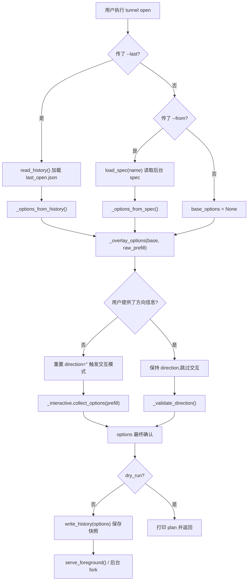

# Tunnel Open 参数复用: `--last`、`--from` 与自动历史记录

## 1. Introduction & Goals

### Problem Statement

`zata-ops tunnel open` 命令需要用户每次重复输入 ssh-host、bind-port、target-port、ssh-user 等参数。对于频繁使用同一套跳板机和端口映射的用户,这种重复输入体验很差,容易出错且浪费时间。

### Proposed Solution Summary

在现有 `tunnel open` CLI 和交互表单基础上,引入**自动历史记录**机制:

- 每次成功 `tunnel open` 后,将非敏感参数(不含密码)自动保存到 `~/.local/share/zata-ops/tunnels/last_open.json`。
- 交互模式下,自动将历史值作为各字段的默认值预填到 questionary 表单中,用户只需修改变化的部分。
- CLI 新增 `--last` 参数,允许非交互模式下一键复用上一次的完整配置。
- CLI 新增 `--from <name>` 参数,允许从已有的后台隧道 spec 文件复制全套参数作为基础配置。
- 显式传入的 CLI flag 始终优先覆盖历史/已有值;`--last` 与 `--from` 互斥。

这个方案复用了现有的 `_state.py` 状态目录机制(`XDG_DATA_HOME` / `~/.local/share/zata-ops/tunnels`)和 `TunnelOptions`/`TunnelSpec` 数据结构,没有引入新的存储层或配置管理子命令,改动集中在 CLI 参数解析层和交互表单预填层。

### Measurable Objectives

- 用户第二次起使用同一套 tunnel 参数时,输入量减少 80% 以上(从 10+ 个 flag 到 0-1 个)。
- 交互模式下,90% 的字段可以直接回车保留默认值。
- `--last` 和 `--from` 的 CLI 路径覆盖 dry-run、前台、后台三种执行模式。
- 密码绝不写入历史文件或 spec 文件;后台模式继续拒绝密码。

### Realistic Validation

- [x] **交互预填真实验证**:在 TTY 环境下执行 `zata-ops tunnel open` (不传 `--direction`),确认表单各字段默认显示上一次成功执行时的值。
- [x] **`--last` CLI 真实验证**:执行 `zata-ops tunnel open --last --dry-run`,确认 plan 中的参数与上一次保存的历史一致。
- [x] **`--from` CLI 真实验证**:先创建后台隧道 `zata-ops tunnel open --background --name test ...`,再执行 `zata-ops tunnel open --from test --dry-run`,确认参数正确复制。
- [x] **覆盖合并真实验证**:执行 `zata-ops tunnel open --last --bind-port 9999 --dry-run`,确认监听端口被覆盖为 9999,其余参数仍来自历史。
- [x] **历史文件落盘验证**:检查 `~/.local/share/zata-ops/tunnels/last_open.json` 内容,确认不含 `ssh_password` 和 `name` 字段。
- [x] **为什么单元测试不够**:单元测试验证了 JSON 读写和参数合并逻辑,但真实 CLI 入口才能验证 Typer 参数解析与 `--last`/`--from` 的互斥行为、交互模式下 questionary 的默认值注入、以及 `serve_foreground`/`serve_daemon` 前历史保存的实际落盘时机。

### Delivery Dependencies

- Group: none
- Depends on groups:
  - none
- Depends on tasks/issues:
  - none
- Gate type: none
- Notes: 纯 CLI 功能增强,无后端服务、数据库或前端依赖。

---

## 2. Requirement Shape

- **Actor**: 频繁使用 `zata-ops tunnel open` 的运维/开发用户。
- **Trigger**: 用户执行 `tunnel open` 命令,希望减少重复参数输入。
- **Expected behavior**:
  1. 每次成功的 `tunnel open` 自动将参数快照(不含密码)写入历史文件。
  2. 交互模式下,表单各字段以上一次值为默认值。
  3. CLI 支持 `--last` 一键复用历史完整配置。
  4. CLI 支持 `--from <name>` 从已有后台隧道复制配置。
  5. 显式 CLI flag 覆盖历史/已有值。
  6. `--last` 与 `--from` 同时使用时报错退出。
- **Explicit scope boundary**:
  - 不涉及配置文件的持久化模板管理(如 `~/.zata-ops/config.yml`)。
  - 不涉及后台隧道 spec 的保留归档(关闭后 spec 仍按现有逻辑清理)。
  - 密码和 `name` 不进入历史文件。
  - 仅影响 `tunnel open` 子命令;`tunnel list/status/close/run` 行为不变。

---

## 3. Repository Context And Architecture Fit

### Current relevant modules/files

| File | Role |
|---|---|
| `src/zata_ops/tunnel/cli.py` | Typer CLI 入口;`open_command` 参数解析、交互/非交互分支调度、后台模式 fork。 |
| `src/zata_ops/tunnel/_state.py` | 后台隧道 spec 的持久化(`TunnelSpec`、JSON 读写、PID 生命周期管理)。 |
| `src/zata_ops/tunnel/_interactive.py` | questionary 交互表单;`collect_options` 逐个字段提问。 |
| `src/zata_ops/tunnel/_runner.py` | SSH 连接、本地/远端转发核心逻辑;`TunnelOptions` dataclass。 |
| `docs/guides/tunnel.md` | 用户-facing 使用文档。 |
| `tests/test_tunnel_*.py` | CLI、交互、状态、重连等测试覆盖。 |

### Existing architecture pattern to follow

- **状态目录复用**: 已有 `state_dir()` 统一解析 `XDG_DATA_HOME` / macOS `Library/Application Support` / `~/.local/share`,历史文件直接放在同一目录下(`last_open.json`),不另开存储路径。
- **Dataclass 传参**: `TunnelOptions` 是 CLI → 交互表单 → 执行层的统一传递结构,历史记录也基于此结构读写。
- **分层隔离**: `_state.py` 不依赖 `_runner.py`(避免循环导入),历史读写函数只操作原生 `dict`,由 `cli.py` 负责与 `TunnelOptions` 的转换。
- **CLI 默认值规则**: Typer `Option` 的默认值保持不变(`direction=""`、`bind_port=0` 等),通过 `_overlay_options` 在运行时合并历史/已有值。

### Ownership and dependency boundaries

- `src/zata_ops/tunnel/_state.py` 拥有历史文件的读写;`cli.py` 拥有合并逻辑和保存时机。
- `_interactive.py` 只消费 `prefill` 中的字段值,不感知历史机制的存在(保持表单逻辑纯粹)。
- 不修改 `_runner.py` 的 SSH/转发逻辑,不引入新的第三方依赖。

### Constraints from runtime, docs, tests, or workflows

- `mkdocstrings` + Google Style Docstrings 规范:新增公共函数需补 docstring。
- `pre-commit` + `ruff` 强制代码格式和类型检查。
- `pytest` 覆盖:新增代码需有对应测试;已有 90 个 tunnel 相关测试全部通过。
- `mkdocs build --strict` 强制文档链接和构建无警告。

### Matching or related PRDs

- `tasks/pending/`: 无相关 pending PRD。
- `tasks/archive/`: 无相关已归档 PRD。
- 本 PRD 独立,无上下游依赖。

---

## 4. Recommendation

### Recommended Approach

在现有 `tunnel open` 流程中内嵌三层复用能力:

1. **自动历史保存**:在 `options` 最终确认后、`dry_run` 判断前,调用 `_state.write_history(...)` 写入 `last_open.json`。
2. **运行时参数合并**:在 `open_command` 中新增 `_overlay_options(base, override)` 函数,以"非默认值即用户显式传入"为规则,把历史/spec 值与 CLI 显式值合并。
3. **交互预填**:默认情况下(用户未传 `--direction`),先加载历史并与 `raw_prefill` 合并,但保留 `direction=""` 以继续触发交互模式;交互表单内各字段的 `default` 参数自然承载合并后的值。

### Why this is the best fit

- **最小改动**:只修改 CLI 层和状态层,不触及 SSH/转发核心,不新增子命令,不新增依赖。
- **零学习成本**:用户不做任何额外操作就能享受交互预填;`--last`/`--from` 是可选的快捷方式。
- **安全默认**:密码和 `name` 被显式排除在历史文件外;后台模式继续拒绝密码。
- **与现有机制一致**:历史文件放在 `state_dir()` 下,与后台 tunnel spec 共用同一目录结构。

### Alternatives Considered

| 方案 | 为什么被拒绝 |
|---|---|
| 引入 `~/.zata-ops/config.yml` 持久化模板 | 过度设计。用户场景是"复用最近一次",不是管理多套命名模板。新增配置文件增加认知负担和同步复杂度。 |
| 保留已关闭的后台 spec 作为"模板" | 现有 `list_specs` 会自动清理僵尸 spec,保留死 spec 与现有生命周期冲突,且需要新增模板管理概念。 |
| 在 `_interactive.py` 内直接调用 `read_history()` | 违反分层隔离。`_interactive.py` 应保持纯粹,不依赖状态持久化细节;由 `cli.py` 负责注入 prefill。 |

---

## 5. Implementation Guide

> This section is a living implementation guide based on current repository analysis. If implementation discovers additional affected files, hidden dependencies, edge cases, or a better path, update this PRD before proceeding.

### Core Logic

**参数合并规则 (`_overlay_options`)**:

```
显式传入判断标准:
- direction:    override != ""
- ssh_host:     override != ""
- ssh_user:     override != _resolve_ssh_user("")   # 特殊:默认值是 $USER,需用环境值比对
- ssh_port:     override != 22
- ssh_key:      override is not None
- bind_host:    override != "127.0.0.1"
- bind_port:    override != 0
- target_host:  override != "127.0.0.1"
- target_port:  override != 0
- strict_host_key: override == True   # bool 默认 False,True 即显式
- name:         override != ""
- background:   override == True     # 同上
- dry_run:      override == True
- reconnect:    override == True
- max_reconnect: override != 0
```

**执行流程 (`open_command`)**:

1. Typer 解析原始 CLI 参数 → `raw_prefill`。
2. 若 `--last`: 调用 `_state.read_history()` → `_options_from_history()` 得到 `base_options`。
3. 若 `--from`: 调用 `_state.load_spec(name)` → `_options_from_spec()` 得到 `base_options`。
4. 互斥检查:`--last` + `--from` → exit 2。
5. 合并:`prefill_options = _overlay_options(base_options, raw_prefill)`。
6. 判断用户是否提供了方向信息:`has_direction_source = bool(raw_prefill.direction) or (base_options has direction)`。
7. 若 `not has_direction_source`: 重置 `prefill_options.direction = ""` 以触发交互模式。
8. 若 `prefill_options.direction == ""`: 进入 `_interactive.collect_options(prefill_options)`。
9. 否则:直接校验 direction 并执行。
10. 在 `dry_run` 判断之前:若 `not options.dry_run`,调用 `_state.write_history(...)` 保存当前参数。

### Change Impact Tree

```text
.
├── src/zata_ops/tunnel/_state.py
│   [新增]
│   【总结】新增历史文件读写函数 write_history / read_history,复用现有 state_dir()
│   ├── HISTORY_FILE_NAME = "last_open.json"
│   ├── history_path() → state_dir() / HISTORY_FILE_NAME
│   ├── write_history(payload: dict) → Path
│   └── read_history() → dict | None
│
├── src/zata_ops/tunnel/cli.py
│   [修改]
│   【总结】新增 --last / --from 参数和合并辅助函数,修改 open_command 流程以支持参数复用
│   ├── 新增参数: last: bool = typer.Option(False, "--last")
│   ├── 新增参数: from_name: str = typer.Option("", "--from")
│   ├── 新增 _options_from_history(history: dict) → TunnelOptions
│   ├── 新增 _options_from_spec(name: str) → TunnelOptions (基于 load_spec)
│   ├── 新增 _overlay_options(base, override) → TunnelOptions
│   │   └── ssh_user 特殊处理:若 override.ssh_user == _resolve_ssh_user("") 则用 base.ssh_user
│   ├── open_command 主体逻辑重构:
│   │   ├── 先构建 raw_prefill,再处理 --last / --from
│   │   ├── has_direction_source 判断
│   │   ├── 无方向信息时重置 direction="" 触发交互
│   │   └── 在 dry_run 前插入 _state.write_history(...)
│   └── 导入更新: from typing import Any, Optional
│
├── src/zata_ops/tunnel/_interactive.py
│   [修改]
│   【总结】改进 ssh_user 的预填逻辑,有 prefill 时作为默认值提问而非直接跳过
│   └── collect_options 中:
│       原: ssh_user = _ask_ssh_user() if not prefill.ssh_user else prefill.ssh_user
│       新: if prefill.ssh_user: ssh_user = _ask_text("SSH 用户名?", prefill.ssh_user)
│           else: ssh_user = _ask_ssh_user()
│
├── tests/test_tunnel_state.py
│   [新增]
│   【总结】覆盖历史文件的读写和异常路径
│   ├── test_write_and_read_history_roundtrip
│   ├── test_read_history_missing_returns_none
│   └── test_read_history_corrupted_returns_none
│
├── tests/test_tunnel_open.py
│   [新增]
│   【总结】覆盖 --last / --from 的 CLI 端到端行为,包括互斥、缺失、合并覆盖
│   ├── test_open_last_without_history_exits_1
│   ├── test_open_last_with_history_reuses_params
│   ├── test_open_last_with_override_merges
│   ├── test_open_from_missing_spec_exits_1
│   ├── test_open_from_existing_spec_copies_params
│   ├── test_open_from_with_override_merges
│   └── test_open_last_and_from_mutual_exclusion
│   └── 新增 import os (用于 os.getpid() 构造 spec)
│
├── tests/test_tunnel_interactive.py
│   [修改]
│   【总结】移除不再需要的 _ask_ssh_user mock,适配 ssh_user 交互变更
│   └── test_collect_options_uses_prefill_for_partial_input:
│       移除 monkeypatch.setattr(_interactive, "_ask_ssh_user", ...)
│
└── docs/guides/tunnel.md
    [修改]
    【总结】在使用文档中新增"复用已有参数"章节,涵盖交互预填、--last、--from 及合并规则
    ├── 交互模式行为约定中新增"历史预填"说明
    └── 快速开始中新增"4. 复用已有参数"小节
```

### Executor Drift Guard

- **隐藏引用**: ` TunnelOptions` 的字段增减会影响 `_overlay_options` 和 `write_history` 的 payload 构造。若未来新增字段,需同步更新三处:`_overlay_options` 的合并逻辑、`_options_from_history` 的字段映射、`write_history` 的 payload 构建。可用 `rg "write_history" src/` 定位所有调用点。
- **状态目录清理**: `list_specs()` 会删除 `.json` 文件中 PID 不存在的僵尸 spec。`last_open.json` 不是 spec 文件(无 `pid` 字段),不会被 `list_specs` 误删。但如果未来有人给 `list_specs` 添加通配清理逻辑,需确保排除 `last_open.json`。
- **循环导入风险**: `_state.py` 不能导入 `_runner.py`。历史读写函数只操作 `dict`,转换逻辑放在 `cli.py` 中。若未来把转换下沉到 `_state.py`,会触发循环导入。

### Flow Diagram



### Realistic Validation Plan

| Behavior | Real Entry Point | Test Layer | Mock Boundary | Data/Env Needed | Command Or Procedure | Required For Acceptance |
|---|---|---|---|---|---|---|
| 交互表单预填历史值 | `zata-ops tunnel open` (TTY, 不传 --direction) | 手动/sandbox | SSH 连接mocked | 先成功执行一次 open 产生历史 | 1. `zata-ops tunnel open --direction local --ssh-host bastion --bind-port 9000 --target-port 5432 --dry-run` 2. `zata-ops tunnel open` 观察表单默认值 | Yes |
| `--last` 复用历史 | `zata-ops tunnel open --last --dry-run` | CLI smoke | SSH 无需真实连接 | `XDG_DATA_HOME` 可写 | `XDG_DATA_HOME=/tmp/xdg zata-ops tunnel open --last --dry-run` | Yes |
| `--from` 复制 spec | `zata-ops tunnel open --from <name> --dry-run` | CLI smoke | SSH 无需真实连接 | 已有后台 spec 文件 | `zata-ops tunnel open --from db-access --dry-run` | Yes |
| 显式 flag 覆盖历史 | `zata-ops tunnel open --last --bind-port 9999 --dry-run` | CLI smoke | SSH 无需真实连接 | 历史文件已存在 | `zata-ops tunnel open --last --bind-port 9999 --dry-run` 检查 plan | Yes |
| 历史文件不含密码 | 检查 `last_open.json` 内容 | 文件系统 | 无 | 用 `--ssh-password` 执行一次 open | `cat ~/.local/share/zata-ops/tunnels/last_open.json \| grep -i password` 应无输出 | Yes |
| `--last` + `--from` 互斥 | `zata-ops tunnel open --last --from x` | CLI smoke | 无 | 无 | 执行后确认 exit_code == 2 | Yes |
| 文档站点无警告 | `mkdocs build --strict` | 文档构建 | 无 | mkdocs 配置完整 | `uv run mkdocs build --strict` | Yes |

### External Validation

No external validation required; repository evidence was sufficient.

---

## 6. Definition Of Done

- [x] `src/zata_ops/tunnel/_state.py` 新增 `write_history` / `read_history`。
- [x] `src/zata_ops/tunnel/cli.py` 新增 `--last` / `--from` 参数和合并逻辑。
- [x] `src/zata_ops/tunnel/_interactive.py` 改进 `ssh_user` 预填。
- [x] `tests/test_tunnel_state.py` 新增历史文件读写测试。
- [x] `tests/test_tunnel_open.py` 新增 `--last` / `--from` CLI 测试。
- [x] `tests/test_tunnel_interactive.py` 适配交互变更。
- [x] `docs/guides/tunnel.md` 更新使用文档。
- [x] 全部 90 个 pytest 通过。
- [x] `mkdocs build --strict` 通过。
- [x] `ruff check` + `ruff format` 通过。
- [x] 代码符合仓库四层架构和依赖方向约束(无跨层违规)。

---

## 7. Acceptance Checklist

### Architecture Acceptance

- [x] `write_history` / `read_history` 位于 `src/zata_ops/tunnel/_state.py`,不导入 `_runner.py`,避免循环依赖。
- [x] `_overlay_options`、`_options_from_history`、`_options_from_spec` 位于 `src/zata_ops/tunnel/cli.py`,与现有 CLI 层职责一致。
- [x] `_interactive.py` 不感知历史机制,仅消费 `prefill` 字段值。
- [x] 无新增第三方依赖。

### Behavior Acceptance

- [x] 成功执行 `tunnel open` 后,`~/.local/share/zata-ops/tunnels/last_open.json` 被创建或更新。
- [x] `last_open.json` 包含:direction, ssh_host, ssh_user, ssh_port, ssh_key, bind_host, bind_port, target_host, target_port, strict_host_key, background, reconnect, max_reconnect。
- [x] `last_open.json` **不包含**:name, ssh_password, dry_run。
- [x] 交互模式下(不传 `--direction`),表单各字段默认值为上一次成功执行时的值。
- [x] `--last` 读取历史文件并与 CLI 显式 flag 合并;显式 flag 优先。
- [x] `--from <name>` 读取已有后台 spec 并复制参数(除 name/background/password 外)。
- [x] `--last` 与 `--from` 同时使用时退出码 2 并提示互斥。
- [x] 无历史记录时用 `--last` 退出码 1 并提示。
- [x] `--from` 引用的 spec 不存在时退出码 1 并提示。
- [x] `dry_run=True` 时不写入历史文件。

### Documentation Acceptance

- [x] `docs/guides/tunnel.md` 新增"复用已有参数"章节,涵盖交互预填、`--last`、`--from`、合并规则。
- [x] 交互模式行为约定中新增"历史预填"说明。
- [x] `mkdocs build --strict` 无警告。

### Validation Acceptance

- [x] `uv run pytest tests/test_tunnel_state.py tests/test_tunnel_open.py tests/test_tunnel_interactive.py -v` 全部通过(44/44)。
- [x] `uv run pytest tests/` 全部通过(90/90)。
- [x] `uv run mkdocs build --strict` 通过。
- [x] `ruff check src/zata_ops/tunnel/cli.py` 通过。
- [x] `ruff format --check` 通过。

---

## 8. Functional Requirements

- **FR-1**: 每次成功的 `tunnel open` 执行后,系统自动将非敏感参数保存到 `~/.local/share/zata-ops/tunnels/last_open.json`。
- **FR-2**: 交互模式下,`tunnel open` 的 questionary 表单各字段默认显示上一次成功执行时的值。
- **FR-3**: CLI 支持 `--last` 参数,一键复用 `last_open.json` 中的完整配置。
- **FR-4**: CLI 支持 `--from <name>` 参数,从名为 `<name>` 的后台隧道 spec 复制参数作为基础配置。
- **FR-5**: 显式传入的 CLI flag 在合并时优先于历史值或已有 spec 值。
- **FR-6**: `--last` 与 `--from` 互斥,同时使用时 CLI 以退出码 2 报错。
- **FR-7**: 历史文件中不得包含 `ssh_password` 和 `name` 字段。
- **FR-8**: `dry_run` 模式下不写入历史文件。
- **FR-9**: 无历史记录时使用 `--last`,CLI 以退出码 1 提示用户。
- **FR-10**: `--from` 引用的 spec 不存在时,CLI 以退出码 1 提示用户。

---

## 9. Non-Goals

- 不引入持久化的"命名模板"或配置文件(如 `~/.zata-ops/tunnel-templates.yml`)。
- 不修改后台隧道 spec 的生命周期(关闭后仍按现有逻辑清理)。
- 不保留已关闭后台隧道的 spec 作为模板来源。
- 不将密码、密钥内容或 `name` 写入历史文件。
- 不影响 `tunnel list/status/close/run` 子命令的行为。
- 不支持多历史记录版本管理(始终只保留最近一次)。

---

## 10. Risks And Follow-Ups

| Risk | Severity | Mitigation | Status |
|---|---|---|---|
| 历史文件损坏导致 `--last` 不可用 | 低 | `read_history()` 捕获 `JSONDecodeError` 并返回 `None`,退化为"无历史"行为,用户会收到友好提示。 | 已处理 |
| 换机器后 `$USER` 不同,历史中的 `ssh_user` 被当前 `$USER` 覆盖 | 低 | `_overlay_options` 中 `ssh_user` 特殊处理:若 CLI 未显式传 `--ssh-user`(即值等于当前环境 `$USER`),优先使用历史值。 | 已处理 |
| 未来 `TunnelOptions` 新增字段,历史读写和合并逻辑遗漏 | 中 | Executor Drift Guard 已标注三处需同步更新;新增字段时可用 `rg "write_history\|_overlay_options\|_options_from_history"` 定位。 | 文档化 |
| `list_specs()` 未来扩展通配清理误删 `last_open.json` | 低 | `last_open.json` 无 `pid` 字段,当前 `list_specs` 按 `*.json` 读取但只检查 `pid` 存活,不会误删。若未来逻辑变化需显式排除。 | 文档化 |

---

## 11. Decision Log

| ID | Decision | Chosen | Rejected | Rationale |
|---|---|---|---|---|
| D-01 | 历史文件存储位置 | 复用现有 `state_dir()` 下的 `last_open.json` | 新增 `~/.zata-ops/history/` 或 `~/.config/zata-ops/` 目录 | 与后台 tunnel spec 共用同一目录结构,减少用户需要管理的隐藏目录数量,且 `state_dir()` 已处理 XDG/macOS/回退路径。 |
| D-02 | 历史值与交互模式的集成方式 | `cli.py` 加载历史并注入 `prefill`,保留 `direction=""` 触发交互 | `_interactive.py` 内部直接调用 `read_history()` | 保持 `_interactive.py` 纯粹,不依赖状态持久化细节;交互表单只消费 `prefill`,测试和复用更简单。 |
| D-03 | `ssh_user` 合并规则 | 若 CLI 值等于当前环境 `$USER`(即用户未显式传入),优先使用历史值 | 统一用 `or` 逻辑合并 | `resolved_user_from_cli("")` 始终返回非空 `$USER`,简单的 `or` 会导致历史 `ssh_user` 永远被覆盖,特殊处理是必要的。 |
| D-04 | `--from` 的 `name` 和 `background` 处理 | 不复制 `name` 和 `background`,默认值空/False | 完整复制 spec 的所有字段 | `name` 是 spec 的文件名标识,复制会导致命名冲突;`background` 是执行模式选择,用户可能想基于后台配置跑前台测试。 |
| D-05 | 历史文件是否保存 `dry_run` | 不保存 | 保存 `dry_run` 字段 | `dry_run` 是预览模式,不应影响下一次真实执行的默认值;且 `dry_run=True` 时本身就不触发 `write_history`。 |
