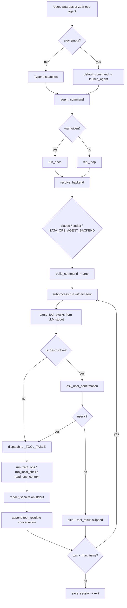

# zata-ops Agent 终端（AI 驱动的运维 REPL）

- GitHub Issue: https://github.com/zata-zhangtao/zata-ops/issues/1

## 1. Introduction & Goals

### Problem Statement

`zata-ops` 当前是一个纯 Typer CLI,所有功能(db 备份、env 初始化、tunnel、logs、dashboard)都要靠用户**手动查文档 + 拼参数 + 传 flag**。这带来三类摩擦:

- 日常操作(备份、列备份、恢复、检查连通)参数繁琐,新人需要先去 `README.md` 或 `guides/` 查语法。
- 出问题时(恢复时挑时间戳、隧道参数复用)需要执行多步,容易漏掉前置检查。
- 缺乏面向"运维意图"的入口;用户必须先把自己的意图翻译成 zata-ops 子命令。

我们要让 `zata-ops` 升级为一个**AI Agent 终端**:无参启动进入 REPL 风格 TUI,用户用自然语言描述运维意图,Agent 推荐并执行对应的 `zata-ops` 子命令或本地 shell 命令,危险操作经确认。

### Proposed Solution Summary

在 `src/zata_ops/agent/` 下新增一个独立的 Agent 终端子系统,**复用用户本地已登录的 Claude/Codex/Kimi CLI**(参考 `~/code/keda` 的 `SubprocessContentGenerator` + `_build_content_generation_command` 模式),不引入新的 API Key、不接 Anthropic SDK:

- 新增 `zata-ops agent` 子命令,显式进入 Agent REPL。
- 将 `src/zata_ops/cli.py` 顶层 `app` 的 `no_args_is_help` 改为 `False`,并加一个**默认命令**:无参启动 `zata-ops` 时等价于 `zata-ops agent`。`zata-ops --help` / `zata-ops db --help` 等现有行为保持不变。
- REPL 由 `prompt_toolkit` 提供多行输入与历史(`prompt` 已经在仓库 `typer-tutorial.md` 调研范围内,需要新增到 `pyproject.toml`),`rich.Console` 提供渲染(已在依赖里)。
- Agent 后端是**子进程封装**:探测用户 PATH 中可用 `claude` / `codex`,**优先 `claude`**(`claude -p --permission-mode plan`,显式只读,禁止 Bash/Edit/Write);不可用时降级到 `codex`(`--sandbox read-only --ask-for-approval never exec` 原生只读沙箱)。可通过 `ZATA_OPS_AGENT_BACKEND` env 强制指定。`kimi` 不在首版实现范围内。
- 工具协议**不依赖 function calling**:Agent 输出的命令以 fenced JSON 块(```zata-ops-tool\n{"tool": "run_zata_ops", "args": {...}}\n```)出现在 stdout,我们的解析器抓出来逐项执行,执行结果回传给下一轮 turn。destructive 命令(`db restore` / `env provision` / `tunnel close` / `rm` / `drop` 等)在解析后、执行前**强制二次确认**。
- 上下文自动注入:启动时读取 `cwd`、`PROJECT`、git branch/status、`.env` / `.env.local` 的 key 名(不传值)、`zata-ops --help` 与各子命令 `--help` 拼出的命令 schema、最近 20 条 shell 历史。
- 复用现有 `config.load_settings()` 加载 env 键,新增 `agent/_context.py` 单独负责 schema 抓取与历史读取,不污染 `config.py`。
- 复用 `tunnel/_state.py` 的 `state_dir()` 习惯,把 Agent 会话状态(只持久化非敏感的 `last_summary`、`turn_count`、用户偏好)放 `~/.local/share/zata-ops/agent/session.json`,与 `tunnels/` 平级。
- 提示词文件 `src/zata_ops/agent/prompts/system.md` 用 UTF-8 显式读写,可被用户用 `$EDITOR` 修改后下次启动生效(无内置编辑器)。
- **复用 `tunnel/_interactive.py` 的 TTY 检测模式**:非 TTY 环境(管道、CI)启动 `zata-ops agent` 给出友好错误并退出码 1,不静默进入。

本方案**复用 `~/code/keda` 已有的子进程 Agent 思路**,**不引入 anthropic SDK**,**不引入新的配置层**,**不破坏现有 CLI**。

### Measurable Objectives

- 用户输入"帮我备份数据库",Agent 在 1 轮内返回 `zata-ops db backup --dry-run` 推荐,确认后 2 轮内执行完成。
- `zata-ops`(无参)直接进入 REPL,`zata-ops --help` 仍然列出全部子命令,两条入口都不破坏现有 smoke 测试。
- 单次会话连续工作 50 轮内不出现 `key error` / 上下文超长崩溃;`ZATA_OPS_AGENT_MAX_TURNS=200` 可调到 200。
- Destructive 命令(根据黑名单 `db restore`, `env provision`, `env fix`, `tunnel close`, `tunnel run`, 任何 `rm/rm -rf/drop/truncate/kill -9` 模式)必须先 `--dry-run` 或 `explain`,用户 `y` 确认后才执行,执行结果回显包含退出码。
- `.env` / `.env.local` 里的 `*_SECRET*` / `*_KEY*` / `*_PASSWORD*` / `*_TOKEN*` 字段:**名字**进入 LLM 上下文,**值**永远不进入;LLM 输出若含值,渲染前用 `***` 替换。
- 用户能通过 `--backend claude|codex` 显式选择后端,无 `claude` 时降级 `codex`(read-only sandbox),再无时报错并给出"安装 claude 或 codex"的提示。

### Realistic Validation

- [ ] **默认入口回归真实验证**:在临时 `cwd` 中执行 `uv run zata-ops` 与 `uv run zata-ops agent`,两者都进入 REPL 提示符;同时 `uv run zata-ops --help` 仍打印完整子命令列表(不进入 REPL)。
- [ ] **后端探测真实验证**:分别用 `PATH` 临时去掉 `claude` / `codex`,执行 `zata-ops agent --print-backend`,确认按 `claude → codex` 顺序降级并打印最终选择;`--backend claude` 时确认 argv 包含 `--permission-mode plan`,不包含 `--dangerously-skip-permissions`。
- [ ] **自然语言推荐真实验证**:在 `ZATA_OPS_AGENT_FAKE_LLM=1` 模式(走预录 JSON)下,执行 `zata-ops agent --run "备份数据库"`,确认 Agent 推荐 `zata-ops db backup --dry-run`,`y` 后执行并捕获到 `--dry-run` 的 plan 输出。
- [ ] **Destructive 强制确认真实验证**:执行 `zata-ops agent --run "恢复 2026-06-07_180000"`,Agent 内部若尝试 `zata-ops db restore ...` 必须先列出时间戳让用户挑选;直接给 `rm -rf /tmp/foo` 时,解析器拦截并要求 `y/N`。
- [ ] **密钥脱敏真实验证**:在 `.env` 写入 `FAKE_SECRET=hunter2`,`zata-ops agent --run "echo $FAKE_SECRET"` 后,终端回显里不出现 `hunter2`(只出现 `***` 或完全省略),即使 LLM 输出包含。
- [ ] **为什么单元测试不够**:单元测试可以验证 JSON 解析、tool 路由、destructive 黑名单、密钥正则脱敏,但只有真实 CLI 入口才能验证 Typer 默认命令分支、`no_args_is_help=False` 与 `--help` 的并存、子进程封装与本地 CLI 的实际握手、prompt_toolkit 的多行/历史行为,以及 TTY/管道下的 graceful error 路径。

### Delivery Dependencies

- Group: none
- Depends on groups:
  - none
- Depends on tasks/issues:
  - none
- Gate type: none
- Notes: 纯新增 `zata-ops agent` 子命令 + 顶层默认入口,无后端服务、数据库、远程依赖。子进程依赖 `claude` 或 `codex` 至少一个;这些是用户运行时工具,不是本 PRD 引入的依赖。

---

## 2. Requirement Shape

- **Actor**: Zata 下游项目的维护者 / DevOps / SRE,日常在终端工作。
- **Trigger**: 用户在项目根目录(或任意 cwd)输入 `zata-ops` / `zata-ops agent`,希望用自然语言完成日常运维动作。
- **Expected behavior**:
  1. 启动后显示 Claude-like 界面:头部一行项目信息(版本、`PROJECT` slug、cwd、git 分支、当前后端),下方为对话流,底部为带 `>` 提示符的输入区。
  2. 用户输入自然语言,Agent 给出推荐命令 + 简短解释,要求 `y/N` 确认;destructive 命令要求 `--dry-run` 预览 + 二次 `y` 才执行。
  3. 执行结果显示退出码 + 关键 stdout 摘要(完整 stdout 落到 `~/.local/share/zata-ops/agent/sessions/<id>.log`)。
  4. 支持 slash 命令:`/help` `/clear` `/exit` `/dry-run` toggle `/model <name>` `/backend <name>` `/history`。
  5. 无可用 LLM CLI 时(`PATH` 都没有),打印一段指引并以退出码 1 退出,不进入 REPL。
  6. 非 TTY 环境(`!stdin.isatty()`)打印指引并退出码 1,要求用户用 `--run "<prompt>"` 单次执行模式。
  7. `run_local_shell` 工具**默认禁用**;仅当用户显式通过 `--allow-shell` 或 `ZATA_OPS_AGENT_ALLOW_SHELL=1` 开启时才可执行本地 shell,且仍需过 destructive 黑名单 + `y/N` 确认。
- **Explicit scope boundary**:
  - 不引入 `anthropic` SDK 或任何新的 Python LLM 客户端;首版只调本地 `claude` / `codex` CLI,`kimi` 暂不实现。
  - 不做多 LLM provider 抽象层;后端选择是探测式降级 + env 覆盖,不抽 base class。
  - 不做会话持久化(只持久化轻量状态:turn count、last summary、用户偏好如 backend 显式指定);完整对话历史写到 log 文件,**不**做 resume/replay。
  - 不做插件 / skill / marketplace 系统。
  - 不做远程 SSH 编排,只复用现有 `zata-ops env provision/fix` 子命令。
  - 不做 rate limit / 计量计费;依赖底层 CLI 自己的限流。

---

## 3. Repository Context And Architecture Fit

### Current relevant modules/files

| File | Role |
|---|---|
| `src/zata_ops/cli.py` | 顶层 Typer app;目前 `no_args_is_help=True`,子命令 db/env/logs/dashboard/tunnel 注册在此。 |
| `src/zata_ops/config.py` | `OpsSettings` + `load_settings(working_dir)`,从 `.env` / `.env.local` 加载,本次**只读**。 |
| `src/zata_ops/tunnel/_interactive.py` | TTY 检测 + `questionary` 表单;`FormCancelledError`、`_ensure_tty()` 模式可直接借鉴。 |
| `src/zata_ops/tunnel/_state.py` | `state_dir()`(XDG/macOS 兼容),JSON 读写,PID 生命周期;agent 自己的 `session.json` 放在 `state_dir() / "agent"`。 |
| `src/zata_ops/tunnel/cli.py` | 长 Typer 命令的写法、rich 输出、退出码 1/2/130 习惯,作为新子命令的参考。 |
| `pyproject.toml` | 已含 `rich`、`typer`、`questionary`、`pydantic-settings`;需新增 `prompt_toolkit`。 |
| `tests/test_cli_smoke.py` | 用 `typer.testing.CliRunner` 验证子命令帮助;需扩展覆盖 `zata-ops` / `zata-ops agent` 默认入口。 |
| `tests/conftest.py` | pytest fixture;agent 测试用 `monkeypatch` 注入 fake subprocess 与 fake `~/.local/share` 临时目录。 |
| `mkdocs.yml` | 现有 nav 包含 `guides/` 与 `ai-standards/`;新增 `guides/agent.md` 后要加到 nav。 |
| `~/code/keda/src/backend/engines/agent_runner/factory.py` | 复用模板:`_build_content_generation_command(agent_name, prompt, cwd)` 已经为 claude / codex / kimi 拼好 argv;`SubprocessContentGenerator` 已经封装了 read-only 调用模式。本 PRD **只复用 claude / codex 两种后端**,kimi 不实现。本次**不**复制代码,只把等价模式用 Typer + prompt_toolkit 风格重写。 |
| `~/code/keda/src/backend/infrastructure/process_runner.py` | 复用模板:UTF-8 显式、子进程超时 watchdog、Claude stream-json 渲染;agent 不需要 stream-json(走 non-interactive `-p` / `exec`),只需要 timeout + UTF-8 即可。 |

### Existing architecture pattern to follow

- **Typer 子命令**:`@app.command("name")` 写函数,带类型注解和 `typer.Option(...)`;`console = Console()` 在模块顶层;异常路径 `console.print(f"[red]...[/red]")` + `raise typer.Exit(code=N)`,对应 1(运行时错)/2(用户输入错)/130(取消)。新 `agent` 子命令遵循同样模式。
- **顶层默认入口**:把 `no_args_is_help=False`,加一个 `default_command` 走 `_launch_agent()`;`--help` 仍然打印 help(Typer 自带,与默认命令互不干扰)。
- **状态目录**:复用 `state_dir()`(XDG/macOS),新文件放 `state_dir() / "agent"`,与 `tunnels/` 平级,不破坏 `tunnels/` 现有内容。
- **配置加载**:agent 不引入新 settings 类;通过 `config.load_settings(cwd)` 读 `PROJECT`,env keys 由 `agent/_context.py` 自行扫描 `.env` 文件名(不读值)。
- **TTY 检测**:`_ensure_tty()` 模式照搬,但非 TTY 时给出"用 `--run` 走单次模式"的可执行建议。
- **Naming + Docstring**:遵循 `docs/ai-standards/naming.md` 的 SSA 风格(每步产生新变量名,不复用 `data` / `result`),公共 API 用 Google Style Docstring。
- **Code reuse**:destructive 命令黑名单、密钥脱敏正则、tool 路由表都先抽到 `agent/_safety.py`,`run_tool()` 调用;同一份逻辑可以被 `agent/--run` 单次模式与 REPL 主循环复用,避免双份实现。

### Ownership and dependency boundaries

- `src/zata_ops/agent/__init__.py` 暴露公共入口(可选,主要用于测试与 import 隔离)。
- `src/zata_ops/agent/cli.py`:`@app.command("agent")` 入口,处理参数解析(backend、model、--run、--print-backend),调度 `_launch_agent()` 或 `_run_once()`。
- `src/zata_ops/agent/_repl.py`:REPL 主循环(prompt_toolkit 读取用户输入、渲染对话流、转交 runner)。
- `src/zata_ops/agent/_backend.py`:探测与构造子进程 argv(参考 keda 的 `_build_content_generation_command`),定义 `Backend` enum 与 `resolve_backend()`;`run_turn()` 把 LLM 输出(可能含多个 tool fenced block)解析出来。
- `src/zata_ops/agent/_tools.py`:tool schema + executor(`run_zata_ops_command`、`run_local_shell`、`ask_user_confirmation`、只读 `read_env_context`)。tool 路由表是 `dict[str, Callable]`,不依赖具体后端。
- `src/zata_ops/agent/_safety.py`:`is_destructive_command()` / `redact_secrets()` / `confirm()`。被 `_tools.py` 与 `_repl.py` 复用。
- `src/zata_ops/agent/_context.py`:启动时抓 `cwd`、git 信息、env keys、zata-ops 子命令 schema(用 `subprocess.run(["zata-ops", "<sub>", "--help"])`)、shell 历史(`~/.bash_history` / `~/.zsh_history` 简单读最近 20 行)。
- `src/zata_ops/agent/prompts/system.md`:UTF-8 显式读写;运行时拼接 cwd/git/env-keys/schema/history,构造最终 system prompt。
- `src/zata_ops/agent/_state.py`:本地会话状态(turn count、上次 backend、上次 dry-run 偏好),用 JSON 落到 `state_dir() / "agent" / "session.json"`。
- 不修改 `db/`、`env/`、`logs/`、`observability/`、`tunnel/` 任何现有文件;不修改 `config.py`。
- 不引入 `anthropic` / `openai` / `google-generativeai` Python SDK,只调本地 CLI。

### Constraints from runtime, docs, tests, or workflows

- `docs/ai-standards/naming.md` 强制 SSA、显式类型、不允许 `data/result/tmp`。
- `docs/ai-standards/comments-docstrings.md` 强制 Google Style Docstrings + UTF-8 显式 I/O + 短注释。
- `docs/ai-standards/testing.md` 要求分层:unit(prompt 解析、tool 路由、destructive 黑名单、密钥脱敏正则)+ integration(用 fake backend,跑通一轮 turn)+ real entry(`zata-ops agent --run` + `zata-ops` 无参,真实 prompt_toolkit + 真实本地 CLI)。
- `docs/ai-standards/documentation.md` 要求新增长期文档页同步到 `mkdocs.yml` nav。
- `just lint --full` + `just test` 必须在合并前绿。`just lint --reuse` 复盘 agent/_tools.py 时关注 destructive 黑名单是否与 tunnel/cli.py 的安全模式重复,如有重叠应统一到 `_safety.py`。
- 单文件 1000 行上限(`check_max_file_lines.py`);agent 子系统按职责拆分,预期每文件 100-300 行。
- `pre-commit` 不会自动跑真实子进程;PR CI 也不一定安装 `claude` / `codex`,因此真实 CLI 集成验证**显式 opt-in** 通过 env `ZATA_OPS_AGENT_REAL_BACKEND=1`,默认 CI 走 fake backend。
- 不允许破坏现有 `zata-ops db backup`、`tunnel open` 等所有现有 CLI 行为;`tests/test_cli_smoke.py` 必须全绿。
- `zata-ops` 顶层默认入口改动(`no_args_is_help=False` + 默认命令)是新行为,但通过"`--help` 仍可用"保证向后兼容。

### Matching or related PRDs

- `tasks/pending/`:无相关 pending PRD。
- `tasks/archive/P1-FEAT-20260611-105500-tunnel-open-reuse-params.md`:无关(那是 tunnel open 的历史/spec 复用,不是 agent);但其"复用既有 `_state.py` 的 `state_dir()`"模式值得借鉴。
- 本 PRD 独立,无上下游依赖,不阻塞/不被任何 PRD 阻塞。

---

## 4. Recommendation

### Recommended Approach

按"最小增量、复用 keda 模式、零新依赖"的原则,新增 `zata-ops agent` + 顶层默认入口:

1. **新增 `src/zata_ops/agent/` 子包**,按职责拆 6 个文件(`cli` / `_repl` / `_backend` / `_tools` / `_safety` / `_context`)+ 1 个 prompt 模板(`prompts/system.md`)+ 1 个状态文件(`_state.py`)。
2. **子进程后端** 直接调 `claude` / `codex` 的 non-interactive 入口,**均保持只读/沙箱化**,**不**用 `--dangerously-skip-permissions`:
   - claude:`claude -p --permission-mode plan <prompt>`(主路径;`plan` 模式禁止 Bash/Edit/Write,只允许 Read/Glob/Grep/WebSearch/WebFetch 等只读工具)
   - codex:`codex --cd <cwd> --sandbox read-only --ask-for-approval never exec <prompt>`(降级路径;原生只读沙箱)

   `kimi` 不在首版范围内。
3. **Tool 协议**:Agent 输出 ```zata-ops-tool\n{"name": "run_zata_ops", "args": {"subcommand": "db", "command": "backup", "args": ["--dry-run"]}}\n``` 形式,我们的解析器扫 stdout 中所有 fenced block,逐个 dispatch 到 `_tools.py` 的路由表。destructive 命中黑名单 → 走 `ask_user_confirmation` → 执行 → 把 stdout/stderr 摘要回传下一轮 turn。
4. **默认入口改动**:`src/zata_ops/cli.py` 把 `no_args_is_help=True` 改成 `False`,加一个 `default_command` callback(在 Typer 1.0+ 用 `app.default_command` 模式或 fallback `if not argv: launch_agent()`),`--help` 行为不变。
5. **新增依赖**:`prompt_toolkit`(REPL 多行 + 历史)。`anthropic` 等 SDK **不**加。
6. **测试**:fake backend(`ZATA_OPS_AGENT_FAKE_LLM=1` 注入预录 JSON)做 unit + integration;`ZATA_OPS_AGENT_REAL_BACKEND=1` 跑真实 CLI 走 smoke。CI 默认 fake。

### Why this is the best fit

- **复用 keda 已验证的子进程后端**:`codex --sandbox read-only --ask-for-approval never exec` 已经在 keda production 用过,我们采用相同 argv。
- **零新依赖**:不引 SDK,不引新的配置层,不引 skill 系统;只加 `prompt_toolkit` 一项。
- **与现有 CLI 共存**:`zata-ops` 无参进 agent,`zata-ops --help` 与 `zata-ops db backup` 全部不变,`tests/test_cli_smoke.py` 只新增 1 个 `test_agent_default_entry_does_not_show_help`。
- **安全与体验解耦**:`claude` 的 `--permission-mode plan` 禁止写/ shell 工具,是第一层防线;`codex` 的 read-only sandbox 是第二层;我们自己的 destructive 黑名单 + `y/N` 是第三层。`run_local_shell` 默认禁用,再补一层显式 opt-in。
- **可演进**:未来要加新后端,只需在 `_backend.py` 的探测表加一行;要加新 tool,只需在 `_tools.py` 的路由表加一行。都不动其他文件。

### Alternatives Considered

| 方案 | 为什么被拒绝 |
|---|---|
| 接 `anthropic` Python SDK,用 `ANTHROPIC_API_KEY` env | 引入 SDK 维护成本;用户**已经有了**本地 Claude/Codex CLI,再加一个 API Key 体验更差;keda 已经验证子进程模式够用。 |
| 抽 `Backend` base class + 多个 provider plugin | 过度设计;现在只有 3 个后端,switch-by-name 枚举就够。等真有第 4 个再抽。 |
| 直接把 `SubprocessRunner` 从 keda 复制过来 | keda 的 `process_runner.py` 与 keda 的 `IProcessRunner` 接口、日志、git context 深度耦合;复制需要剪裁。zata-ops 只要 timeout + UTF-8 + 退出码 即可,20 行就够了。 |
| 让 `zata-ops` 无参保持显示 help,只走 `zata-ops agent` | 违背用户明确诉求("输入 zata-ops 它就自动打开")。 |
| 把 agent 做成 TUI(`textual`)而不是 REPL | `textual` 强但学习曲线对下游开发者高;REPL(`prompt_toolkit`)+ `rich` 已能覆盖"对话流 + 输入框"两种需求,更简单。 |
| 用 socket 启动常驻 daemon,REPL 走 socket | 引入新进程模型,增加部署与排错成本;`tunnel --background` 模式已经足够参考,不必复制到 agent。 |
| `claude` 用 `--dangerously-skip-permissions -p` 做主路径 | 该 flag 会跳过所有权限提示,让 LLM 直接调用 Bash/Edit/Write/网络工具;配合 `run_local_shell` 等同于把本机执行权交给 LLM,风险不可接受。 |

---

## 5. Implementation Guide

> This section is a living implementation guide based on current repository analysis. If implementation discovers additional affected files, hidden dependencies, edge cases, or a better path, update this PRD before proceeding.

### Core Logic

**1. 默认入口路由(`src/zata_ops/cli.py`)**

```
argv = sys.argv[1:]
if not argv:
    → _launch_agent()
elif argv[0] in {"--help", "-h", "--version", "-V"}:
    → Typer 正常走
elif argv[0] == "agent":
    → Typer 走 agent 子命令
else:
    → Typer 走对应子命令
```

实现方式:把 `no_args_is_help` 设为 `False`,并在 `if __name__ == "__main__":` 之前加 `if not argv: launch_agent(); raise typer.Exit()`,或者注册一个 `@app.callback(invoke_without_command=True)` 的 root callback,里面检查 `ctx.invoked_subcommand is None` 就转 `agent_command.callback(...)`。

**2. 后端探测(`src/zata_ops/agent/_backend.py`)**

```
_ZATA_BACKEND_TABLE = [
    ("claude", ["claude", "--version"]),
    ("codex",  ["codex",  "--version"]),
]

def resolve_backend() -> str:
    forced = os.environ.get("ZATA_OPS_AGENT_BACKEND")
    if forced:
        return forced
    for name, probe in _ZATA_BACKEND_TABLE:
        if shutil.which(probe[0]):
            return name
    raise AgentBackendMissingError(...)
```

**3. Tool 协议(`src/zata_ops/agent/_tools.py` + `_safety.py`)**

LLM 在响应里输出 fenced block(由 `prompts/system.md` 提示):

```zata-ops-tool
{"name": "run_zata_ops", "args": {"subcommand": "db", "command": "backup", "args": ["--dry-run"]}}
```

正则解析所有 fenced block → 路由到 `_TOOL_TABLE[name](args, ctx)`;destructive 黑名单(由 `_safety.is_destructive_command()` 判断:子命令路径 + 命令行文本双匹配)命中 → `ask_user_confirmation` → 拒绝则跳过,接受则执行;执行结果写回 `tool_result` 块,作为下一轮 turn 的 `tool_result` 输入拼接进 prompt。

**4. REPL 主循环(`src/zata_ops/agent/_repl.py`)**

```
session = AgentSession(state_dir() / "agent" / "session.json")
backend = resolve_backend()
console.print(header_banner)  # rich
history = FileHistory(state_dir() / "agent" / "repl_history")
session_input = PromptSession(history=history, multiline=True)
while turn < max_turns:
    raw_user_text = session_input.prompt("> ")
    if raw_user_text.startswith("/"):
        handle_slash(raw_user_text)
        continue
    new_messages = run_one_turn(
        backend=backend,
        system_prompt=render_system_prompt(ctx),
        conversation=session.conversation,
        user_text=raw_user_text,
    )
    session.conversation.extend(new_messages)
    session.turn_count += 1
    session.save()
```

**5. 单次模式 `zata-ops agent --run "<prompt>"`**

跳过 REPL,直接 `run_one_turn()` 一次,把对话流用 rich 渲染,最后一条 assistant message 打印到 stdout。CI 与脚本里都好用。

**6. `--print-backend`**

只跑 `resolve_backend()` 打印后端名与版本(`<backend> <version>`),退出码 0;用于 `PATH` 探测验证。

### Change Impact Tree

```text
.
├── src/zata_ops/cli.py
│   [修改]
│   【总结】把 no_args_is_help 改为 False,加无参默认入口转 agent;--help/--version 行为不变
│   ├── app = typer.Typer(no_args_is_help=False, ...)
│   ├── 新增 _default_command(): 无 sys.argv[1:] 时调 agent_command.callback
│   └── if __name__ == "__main__" 之前:加 _default_command 兜底
│
├── src/zata_ops/agent/__init__.py
│   [新增]
│   【总结】agent 子包入口,暴露 launch_agent 与 run_once
│   ├── launch_agent(argv: list[str]) -> int
│   └── run_once(prompt: str, backend: str | None = None) -> int
│
├── src/zata_ops/agent/cli.py
│   [新增]
│   【总结】@app.command("agent") 入口,负责参数解析与调度
│   ├── agent_command(backend: str, model: str, run: str, print_backend: bool)
│   ├── _dispatch_args(backend, model) -> tuple[str, str]
│   └── 错误路径沿用 typer.Exit(1/2)
│
├── src/zata_ops/agent/_repl.py
│   [新增]
│   【总结】REPL 主循环与对话流渲染
│   ├── AgentSession(turn_count, last_backend, last_dry_run)
│   ├── repl_loop(backend, model, max_turns)
│   ├── render_assistant_message(text, console)  # rich 渲染 + 密钥脱敏
│   └── handle_slash(text, session) -> None
│
├── src/zata_ops/agent/_backend.py
│   [新增]
│   【总结】后端探测与子进程封装,argv 拼装参照 keda factory._build_content_generation_command
│   ├── resolve_backend() -> str
│   ├── resolve_backend_version(name) -> str
│   ├── _ZATA_BACKEND_TABLE = [("claude", ...), ("codex", ...)]
│   ├── build_command(backend, prompt, cwd) -> list[str]
│   │   claude: claude -p --permission-mode plan <prompt>
│   │   codex:  codex --cd <cwd> --sandbox read-only --ask-for-approval never exec <prompt>
│   ├── run_turn(backend, prompt, cwd, timeout) -> CommandResult
│   └── AgentBackendMissingError / AgentBackendTimeoutError
│
├── src/zata_ops/agent/_tools.py
│   [新增]
│   【总结】tool schema、路由表、执行器
│   ├── parse_tool_blocks(llm_text: str) -> list[ToolCall]
│   ├── _TOOL_TABLE = {
│   │     "run_zata_ops": _run_zata_ops,
│   │     "run_local_shell": _run_local_shell,   # 默认禁用,需 ZATA_OPS_AGENT_ALLOW_SHELL=1 或 --allow-shell
│   │     "read_env_context": _read_env_context,
│   │     "ask_user_confirmation": _ask_user_confirmation,
│   │   }
│   ├── _run_zata_ops(args, ctx) -> ToolResult
│   ├── _run_local_shell(args, ctx) -> ToolResult   # 高权限 tool:destructive 黑名单 + y/N + opt-in 三重门
│   ├── _read_env_context(args, ctx) -> ToolResult
│   └── _ask_user_confirmation(args, ctx) -> ToolResult
│
├── src/zata_ops/agent/_safety.py
│   [新增]
│   【总结】destructive 黑名单与密钥脱敏,被 _tools.py 和 _repl.py 复用
│   ├── _DESTRUCTIVE_SUBCOMMANDS = {"db restore", "env provision", "env fix", "tunnel close"}
│   ├── _DESTRUCTIVE_PATTERNS = re.compile(r"\brm\s+-rf\b|\bdrop\s+|\btruncate\s+|\bkill\s+-9\b")
│   ├── is_destructive_command(tool_call: ToolCall) -> bool
│   ├── _SECRET_KEY_RE = re.compile(r"(?i).*(secret|key|password|token).*")
│   ├── redact_secrets(text: str) -> str
│   └── confirm(prompt: str, default_no: bool = True) -> bool
│
├── src/zata_ops/agent/_context.py
│   [新增]
│   【总结】启动上下文抓取:env keys、git、命令 schema、shell 历史
│   ├── collect_context(cwd: Path) -> dict
│   ├── _scan_env_keys(cwd) -> list[str]   # 只读 key 名,不读值
│   ├── _scan_git(cwd) -> dict
│   ├── _scan_zata_ops_schema() -> str      # 抓 zata-ops --help + 各子 --help 拼接
│   └── _scan_shell_history() -> list[str]  # 简单读 ~/.bash_history 或 ~/.zsh_history
│
├── src/zata_ops/agent/prompts/system.md
│   [新增]
│   【总结】UTF-8 显式读写,运行时模板渲染注入 context
│   ├── 占位符: {{cwd}} {{project}} {{git_branch}} {{git_status}} {{env_keys}}
│   │          {{zata_ops_schema}} {{shell_history}} {{max_turns}} {{backend}}
│   └── 提示 LLM 用 ```zata-ops-tool\n{...}\n``` 协议输出 tool calls
│
├── src/zata_ops/agent/_state.py
│   [新增]
│   【总结】会话状态落盘,与 tunnels/ 平级
│   ├── _AGENT_STATE_DIR = state_dir() / "agent"
│   ├── load_session() -> AgentSession
│   ├── save_session(session: AgentSession) -> None
│   └── append_session_log(turn_id, payload: dict) -> Path  # 写 .log 完整记录
│
├── pyproject.toml
│   [修改]
│   【总结】新增 prompt_toolkit 依赖;不引 anthropic SDK
│   └── dependencies: + "prompt-toolkit>=3.0.43"
│
├── tests/test_cli_smoke.py
│   [修改]
│   【总结】新增默认入口回归与 agent 子命令帮助测试
│   ├── test_root_default_entry_launches_agent(monkeypatch fake backend)
│   ├── test_agent_subcommand_help_lists_options
│   └── test_print_backend_reports_default(monkeypatch PATH)
│
├── tests/test_agent_backend.py
│   [新增]
│   【总结】后端探测、命令拼装、超时
│   ├── test_resolve_backend_prefers_codex(monkeypatch which)
│   ├── test_build_command_claude_argv
│   ├── test_build_command_codex_argv
│   ├── test_run_turn_timeout
│   └── test_resolve_backend_missing_raises
│
├── tests/test_agent_safety.py
│   [新增]
│   【总结】destructive 黑名单与密钥脱敏
│   ├── test_db_restore_is_destructive
│   ├── test_env_provision_is_destructive
│   ├── test_rm_rf_pattern_caught
│   ├── test_redact_secrets_replaces_value
│   └── test_confirm_default_no
│
├── tests/test_agent_tools.py
│   [新增]
│   【总结】tool 解析与执行
│   ├── test_parse_tool_blocks_extracts_single
│   ├── test_parse_tool_blocks_extracts_multiple
│   ├── test_run_zata_ops_invokes_subprocess(monkeypatch)
│   ├── test_run_local_shell_redacts_secret_output
│   └── test_destructive_blocks_execution_until_confirm
│
├── tests/test_agent_repl.py
│   [新增]
│   【总结】用 fake backend 跑通一轮 turn
│   ├── test_run_once_with_fake_backend_executes_recommended_command
│   ├── test_run_once_destructive_requires_confirm(monkeypatch stdin)
│   └── test_run_once_secrets_not_leaked_to_output
│
├── docs/guides/agent.md
│   [新增]
│   【总结】用户文档:启动、slash 命令、backend 选择、安全
│   ├── 启动方式: zata-ops / zata-ops agent / zata-ops agent --run "..."
│   ├── 后端要求: 安装 claude 或 codex 至少之一
│   ├── /help /exit /clear /dry-run /model /backend
│   └── 安全:destructive 二次确认、密钥脱敏
│
├── mkdocs.yml
│   [修改]
│   【总结】在"使用指南"下加 agent 入口
│   └── 使用指南: + AI 终端: guides/agent.md
│
├── README.md
│   [修改]
│   【总结】补一句 agent 入口提示
│   └── "快速上手" 末尾加: 输入 zata-ops 进入 AI 终端
```

**说明**:上面的文件列表是当前分析下的起点,不代表没有其他受影响文件;特别是 prompt 模板与 tool schema 的边界可能在实现时微调。`_state.py` 的 `state_dir()` 已被 `tunnel/_state.py` 实现,agent 不重新实现,只 import 后取子目录。

### Executor Drift Guard

实现时仓库可能出现以下漂移,需要在以下边界做二次确认:

- **`tunnel/_state.py` 改了 `state_dir()` 路径策略**:agent 复用同一个 `state_dir()`,不会受影响,但要 `rg "state_dir" src/zata_ops/` 确认无破坏性变更。
- **新增 `agent` 子包可能与未来 `agent_runner` / `agent_daemon` 重名**:用 `rg "^class AgentRunner\|class AgentDaemon"` 提前确认 CLI 顶层不会冲突。
- **`prompts/system.md` 用户手改后破坏模板渲染**:`render_system_prompt()` 用 `string.Template` 而不是 `str.format`,降低 `{}` / f-string 误命中。
- **现有 `tests/test_cli_smoke.py` 里的 `assert "tunnel" in help_result.stdout`**:在加 `no_args_is_help=False` 后仍成立(因为 Typer 仍然解析 `--help`),不要无意中改 help 输出。
- **`pyproject.toml` 已经有 `rich` `questionary`,但没有 `prompt_toolkit`**:新增依赖必须用与 `rich` 兼容的版本(>=3.0.43,Python 3.8+ 兼容)。在 `uv lock` 后 `uv run python -c "import prompt_toolkit; print(prompt_toolkit.__version__)"` 验证安装。
- **`/usr/bin/claude` / `/usr/local/bin/codex` 在 CI 不一定存在**:`tests/test_agent_repl.py` 必须能用 fake backend(`ZATA_OPS_AGENT_FAKE_LLM=1` 注入预录 JSON)跑通,真实 CLI 验证显式 opt-in。

**关键 search anchors**:

```bash
rg "no_args_is_help" src/zata_ops/
rg "state_dir\(\)" src/zata_ops/
rg "subprocess.run\|subprocess.Popen" src/zata_ops/
rg "_build_content_generation_command\|build_command" src/zata_ops/
```

### Flow or Architecture Diagram



### Low-Fidelity Prototype

```
zata-ops agent v0.1.0 | backend: codex 0.77 | project: my-app | cwd: /Users/.../my-app | git: main
─────────────────────────────────────────────────────────────────────────
user> 帮我备份数据库,先 dry-run
─────────────────────────────────────────────────────────────────────────
[assistant]
  我会先做一个 dry-run 备份,展示今天会执行什么。

  ```zata-ops-tool
  {"name": "run_zata_ops", "args": {"subcommand": "db", "command": "backup", "args": ["--dry-run"]}}
  ```
─────────────────────────────────────────────────────────────────────────
[tool result] exit=0 stdout=12 lines
─────────────────────────────────────────────────────────────────────────
Run this plan? [y/N] y
[tool] zata-ops db backup --dry-run -> ok (12 lines captured)
[hint] 用 'zata-ops db backup' 真正执行,或 'clear' 后重说 '真正备份'
─────────────────────────────────────────────────────────────────────────
user> /
```

### ER Diagram

No data model changes in this PRD.

### Interactive Prototype Change Log

No interactive prototype file changes in this PRD.

### External Validation

| Topic | Source | Checked On | Relevant Finding | Impact On Recommendation |
|---|---|---|---|---|
| `claude` CLI `--permission-mode plan` | `claude --help`(本机) | 2026-06-12 | `-p` / `--print` 是 non-interactive;`plan` 模式禁止 Bash/Edit/Write,只允许 Read/Glob/Grep 等只读工具 | 主路径,避免 `--dangerously-skip-permissions` 把执行权限交给 LLM |
| `codex` CLI non-interactive 模式与 sandbox 参数 | `codex --help`(本机) | 2026-06-12 | `codex exec` 是 non-interactive 入口,`--sandbox read-only` 把破坏命令拦在沙箱 | 降级路径,双层安全;无需自创 argv |
| `prompt_toolkit` 现状 | `docs/ai-standards/tooling.md` + keda 已有 `process_runner.py` 同样只用 subprocess + timeout | 2026-06-12 | 不需要 `textual` 等更重的 TUI | 选 `prompt_toolkit` 与 rich 渲染 |

无外部 SaaS / 法规 / 标准依赖。

### Realistic Validation Plan

| Behavior | Real Entry Point | Test Layer | Mock Boundary | Data/Env Needed | Command Or Procedure | Required For Acceptance |
|---|---|---|---|---|---|---|
| 顶层 `zata-ops` 无参进入 REPL | `zata-ops` 真实 CLI 入口 | e2e smoke | fake backend(`ZATA_OPS_AGENT_FAKE_LLM=1` 注入预录 stdout) | 临时 cwd | `cd /tmp && ZATA_OPS_AGENT_FAKE_LLM=1 uv run zata-ops --run "备份数据库"` 确认 stdout 含 "zata-ops db backup --dry-run" | Yes |
| `zata-ops --help` 仍打印完整子命令列表 | `zata-ops --help` | smoke | 不需要 mock | 不需要 | `uv run zata-ops --help` 后 `rg "^(.*db.*|.*env.*|.*tunnel.*|.*dashboard.*|.*logs.*)" stdout` | Yes |
| `zata-ops agent --print-backend` 后端探测 | `zata-ops agent --print-backend` | smoke | 用 `PATH=empty:$PATH` 隔离 | 不需要 | `env -i PATH=/usr/bin:/bin ZATA_OPS_AGENT_FAKE_LLM=1 uv run zata-ops agent --print-backend` 期望 stderr 含 "no LLM CLI found" + exit 1;再恢复 PATH 期望 stdout 含 "codex" 或 "claude" | Yes |
| `zata-ops agent --run` 单次模式输出推荐命令 | `zata-ops agent --run "恢复 2026-06-07_180000"` | integration | fake backend 注入 2 轮 JSON | 不需要 | 验证 stdout 含 `db restore` 之前先 `db list`(让用户选) | Yes |
| Destructive 强制确认 | `zata-ops agent --run "rm -rf /tmp/foo"`(fake backend 在第一轮返回 rm 工具) | integration | fake backend | 临时目录 | 验证 agent 阻塞等待 `y/N`,非 y 不执行,exit 非 0 或跳过 tool | Yes |
| 密钥脱敏 | `zata-ops agent --run "echo $FAKE_SECRET"` + .env 含 `FAKE_SECRET=hunter2` | integration | fake backend | 临时 .env | 验证终端 stdout 不含 `hunter2`;`redact_secrets` 单元测试覆盖正则 | Yes |
| 真实 codex 后端真实 run(可选) | `ZATA_OPS_AGENT_REAL_BACKEND=1 zata-ops agent --run "备份数据库" --backend codex` | manual sandbox | 不 mock(用户环境已 login) | 用户 PATH 里有 `codex` | 在用户本机手工验证 1 次;CI 默认不跑 | No(可选) |
| 单文件 < 1000 行 | `uv run python hooks/check_max_file_lines.py --max-lines 1000` | lint | 不需要 | 不需要 | `just lint --full` 通过 | Yes |
| 文档可构建 | `uv run mkdocs build --strict` | docs | 不需要 | 不需要 | `just lint --full` 通过 | Yes |
| 现有 CLI smoke 不回归 | `uv run pytest tests/test_cli_smoke.py` | unit | 不需要 | 不需要 | `just test` 通过 | Yes |

**Failure triage**:

- 如果 `claude` / `codex` 在 CI 镜像里都不存在,unit + integration 测试用 `ZATA_OPS_AGENT_FAKE_LLM=1` 跑通即可;真实后端测试留给本地 manual 验证。
- 如果 `prompt_toolkit` 装不上(依赖冲突),回退到 `input()` + 简单 ANSI 渲染,功能不变但失去多行与历史(降低体验,先 commit 一个降级 PR)。
- 如果 `state_dir()` 路径在 macOS 与 Linux 下不一致,验证走 `tunnel/_state.py` 已覆盖的 XDG 逻辑,不要在 agent 里重复实现。

---

## 6. Definition Of Done

- **Implementation validation**:`uv run pytest tests/` 全绿(包含新增 4 个 agent 测试文件)。
- **Realistic validation**:`zata-ops` 与 `zata-ops agent` 真实入口在 fake backend 下能输出推荐命令,`zata-ops --help` 仍打印全部子命令,`zata-ops agent --print-backend` 在空 PATH 下报错。
- **Docs**:`docs/guides/agent.md` 落地,`mkdocs.yml` nav 已加,`uv run mkdocs build --strict` 通过,`README.md` 快速上手末尾补一句 `输入 zata-ops 进入 AI 终端`。
- **No regression checks**:`just test` 与 `just lint --full` 在合并前必须绿;`tests/test_cli_smoke.py` 不修改(只新增 1-2 个 case)。
- **Architecture-fit checks**:`just lint --reuse` 跑通,`_safety.py` 与 `tunnel/cli.py` 的 destructive 逻辑**不**重复实现,而是 `_safety.py` 提供共享,destructive 黑名单(子命令路径 + 命令行模式)由 `docs/ai-standards/code-reuse.md` 指引维护者合并到一处。
- **Delivery gates**:本 PRD 完成全部 Acceptance Checklist 后,从 `tasks/pending/` 移到 `tasks/archive/`(走 `uv run python hooks/archive_tasks.py`)。

---

## 7. Acceptance Checklist

### Architecture Acceptance

- [ ] `src/zata_ops/agent/` 子包按 `cli` / `_repl` / `_backend` / `_tools` / `_safety` / `_context` / `_state` 拆分,单文件 < 1000 行(用 `uv run python hooks/check_max_file_lines.py --max-lines 1000` 验证)
- [ ] `src/zata_ops/cli.py` 把 `no_args_is_help` 改为 `False`,新增默认入口转 `agent`,`zata-ops --help` 行为不变(用 `rg "no_args_is_help" src/zata_ops/cli.py` 与 `uv run zata-ops --help` 双重验证)
- [ ] `agent/_safety.py` 是 destructive 黑名单 + 密钥脱敏的唯一实现,`_tools.py` 与 `_repl.py` 都引用它(用 `rg "_safety\." src/zata_ops/agent/` 验证至少 2 处引用)
- [ ] `agent/_state.py` 复用 `tunnel/_state.py` 的 `state_dir()`,不重新实现 XDG 解析(用 `rg "from zata_ops.tunnel._state" src/zata_ops/agent/` 验证 import)
- [ ] 不引入 `anthropic` / `openai` / `google-generativeai` Python SDK(用 `rg "^\\s*\"(anthropic|openai|google-generativeai)" pyproject.toml` 验证为空)
- [ ] `src/zata_ops/agent/` 中不出现 `--dangerously-skip-permissions`(用 `rg "dangerously-skip-permissions" src/zata_ops/agent/` 验证为空)

### Dependency Acceptance

- [ ] `pyproject.toml` 的 `dependencies` 新增 `prompt-toolkit>=3.0.43`,`uv lock` 后 `uv run python -c "import prompt_toolkit; print(prompt_toolkit.__version__)"` 输出版本号
- [ ] `pyproject.toml` 不引入 LLM Python SDK(用 `rg "^\\s*\"(anthropic|openai|google-generativeai|cohere)" pyproject.toml` 验证为空)

### Behavior Acceptance

- [ ] `zata-ops` 与 `zata-ops agent` 都进入 REPL;`zata-ops agent --print-backend` 在 PATH 含 `claude` 时输出 `claude <version>`(默认优先 claude),在空 PATH 时 exit 1 并提示安装
- [ ] `ZATA_OPS_AGENT_BACKEND=codex zata-ops agent --print-backend` 强制选择 codex,即使 PATH 里有 claude;验证 `build_command("codex", ...)` 的 argv 包含 `--sandbox read-only --ask-for-approval never exec`
- [ ] 验证 `build_command("claude", ...)` 的 argv 包含 `--permission-mode plan`,不包含 `--dangerously-skip-permissions`
- [ ] `run_local_shell` 工具默认禁用:未传 `--allow-shell` 且未设 `ZATA_OPS_AGENT_ALLOW_SHELL=1` 时,LLM 输出 `run_local_shell` 块应被拦截并提示"需 --allow-shell";开启后仍需 destructive 黑名单 + `y/N`
- [ ] 输入"备份数据库" → Agent 推荐 `zata-ops db backup --dry-run` → 用户 `y` → 真实执行(用 fake backend 验证)
- [ ] 输入"恢复 2026-06-07_180000" → Agent 先 `db list` 让用户挑时间戳,再 `db restore --restore-db --yes`(用 fake backend 验证 2 轮 turn)
- [ ] 输入"删除 /tmp/foo" → 解析器命中 destructive 黑名单,要求 `y/N`;非 y 跳过(单元测试覆盖)
- [ ] `.env` 含 `FAKE_SECRET=hunter2`,`zata-ops agent --run "echo $FAKE_SECRET"` 终端 stdout 不含 `hunter2`(集成测试覆盖)
- [ ] 单次模式 `zata-ops agent --run "..."` 不进入 REPL,输出对话流到 stdout 后退出

### Documentation Acceptance

- [ ] `docs/guides/agent.md` 落地,含:启动方式、后端要求、slash 命令、安全规则、FAQ
- [ ] `mkdocs.yml` 的 nav 已加 `AI 终端: guides/agent.md`(用 `rg "guides/agent.md" mkdocs.yml` 验证)
- [ ] `README.md` "快速上手"末尾补一句 `输入 zata-ops 进入 AI 终端`(用 `rg "AI 终端" README.md` 验证)
- [ ] `src/zata_ops/agent/prompts/system.md` 用 UTF-8 显式读写,`Path.read_text(encoding="utf-8")` 与 `Path.write_text(..., encoding="utf-8")`(用 `rg "encoding=\"utf-8\"" src/zata_ops/agent/` 验证)

### Validation Acceptance

- [ ] `uv run pytest tests/test_cli_smoke.py tests/test_agent_backend.py tests/test_agent_safety.py tests/test_agent_tools.py tests/test_agent_repl.py` 全绿
- [ ] `just lint --full` 全绿(`check_max_file_lines` 不警告,`check-guidelines-consistency` 通过)
- [ ] `uv run mkdocs build --strict` 零警告
- [ ] 真实入口验证:在临时 cwd 中 `ZATA_OPS_AGENT_FAKE_LLM=1 uv run zata-ops --run "备份数据库"`,stdout 包含 "zata-ops db backup --dry-run",exit 0
- [ ] 真实入口验证:`ZATA_OPS_AGENT_FAKE_LLM=1 env -i PATH=/usr/bin:/bin uv run zata-ops agent --print-backend` 退出码 1,stderr 含 "no LLM CLI found"
- [ ] 真实入口验证(可选,本地 manual):`ZATA_OPS_AGENT_REAL_BACKEND=1 zata-ops agent --run "备份数据库"` 在用户本机通过

---

## 8. Functional Requirements

- **FR-1**:`zata-ops` 无参启动等价于 `zata-ops agent`,进入 REPL;`zata-ops --help` / `zata-ops db backup` / `zata-ops tunnel open` 等现有行为不变。
- **FR-2**:`zata-ops agent --print-backend` 输出当前选中的后端名与版本,无后端时 exit 1。
- **FR-3**:后端选择按 `ZATA_OPS_AGENT_BACKEND` env 优先,否则按 `claude → codex` 顺序探测 PATH;再无可用后端时报错退出。`claude` 使用 `--permission-mode plan`;`codex` 使用 `--sandbox read-only`,均不授予 LLM 本地执行/写权限。
- **FR-4**:`zata-ops agent --backend <name>` 临时覆盖后端选择(仅本次),不写 session state;`--allow-shell` 临时开启 `run_local_shell` 工具。
- **FR-5**:`zata-ops agent --run "<prompt>"` 单次模式,跳过 REPL,把对话流渲染到 stdout 后退出。
- **FR-6**:`zata-ops agent --model <name>` 透传给后端(目前只 claude 接受 `--model`;codex 透传 `--model` flag,后端忽略未知 flag 时不报错)。
- **FR-7**:REPL 支持 slash 命令 `/help` `/clear` `/exit` `/dry-run` toggle `/model <name>` `/backend <name>` `/history`。
- **FR-8**:Agent 输出 fenced block(```zata-ops-tool\n{...}\n```)协议,parser 抓出所有 block 逐个 dispatch。
- **FR-9**:Destructive 命令(子命令路径 `db restore` / `env provision` / `env fix` / `tunnel close` + 命令行模式 `rm -rf` / `drop` / `truncate` / `kill -9`)在执行前要求 `y/N` 确认,默认 `N`。
- **FR-10**:`.env` / `.env.local` 扫描只读 key 名;**值**不进入 LLM 上下文;LLM 输出含值时,渲染前用 `***` 替换(规则:key 名匹配 `(?i).*(secret|key|password|token).*`)。
- **FR-11**:启动时自动注入上下文:`cwd`、`PROJECT`、git branch/status、env keys(不传值)、zata-ops 子命令 schema、shell 历史最近 20 条;模板用 `string.Template` 渲染,`$variable` 误命中风险低于 f-string。
- **FR-12**:会话状态(`turn_count`、`last_backend`、`last_dry_run_preference`)落 `state_dir() / "agent" / "session.json"`,与 `tunnels/` 平级;完整对话流落 `state_dir() / "agent" / sessions/<id>.log`(append-only,UTF-8)。
- **FR-13**:单次会话 `max_turns` 默认 50,可通过 `ZATA_OPS_AGENT_MAX_TURNS` 覆盖;达到上限后自动 save 并退出码 0。
- **FR-14**:非 TTY 环境(`!sys.stdin.isatty()`)启动 `zata-ops agent` 报错退出码 1,提示用 `--run` 单次模式。
- **FR-15**:不引入 LLM Python SDK(anthropic/openai/google-generativeai/cohere),只调本地 CLI 子进程。
- **FR-16**:`run_local_shell` 工具**默认禁用**,仅当用户显式通过 `--allow-shell` 或 `ZATA_OPS_AGENT_ALLOW_SHELL=1` 开启时才可调度;开启后仍须满足 FR-9 的 destructive 黑名单 + `y/N` 确认。

---

## 9. Non-Goals

- 不做多 LLM provider 抽象 base class;后端探测 + 简单 switch 即可。
- 不做会话持久化(只持久化轻量状态);完整对话流 append-only log,**不**做 resume/replay。
- 不做插件 / skill / marketplace 系统;tool 表是写死的 4 个,改时直接改 `_tools.py`。
- 不做远程 SSH 编排;只复用现有 `zata-ops env provision/fix` 子命令。
- 不做 rate limit / 计量计费 / token 计数显示。
- 不做 plan / cost 估算 UI;destructive 命令的 dry-run 预览就是 plan。
- 不做多用户 / multi-tenant;agent 是单用户本地工具。
- 不动现有 `db/`、`env/`、`logs/`、`observability/`、`tunnel/` 任何文件。
- 不在 `pyproject.toml` 加 `anthropic` / `openai` / LLM Python SDK。

---

## 10. Risks And Follow-Ups

- **Risk:本地 LLM CLI 行为变化**(如 `codex` 未来把 `--sandbox read-only` 改名)。**缓解**:argv 拼装集中到 `_backend.py` 单点;升级后只在 `tests/test_agent_backend.py` 改 1-2 行。
- **Risk:LLM 在 prompt 里"自作聪明"绕过 tool 协议**,直接打印命令而不发 fenced block。**缓解**:parser 抓不到 block 时,fallback 提示 "未检测到 zata-ops-tool block,请用 fenced JSON 重新回答";并把 system prompt 的"必须用 fenced block 协议"写得很死。
- **Risk:`claude` 后端误用 `--dangerously-skip-permissions` 导致 LLM 可直接调用 Bash/Edit/Write**。**缓解**:PRD 明确要求 `claude` 使用 `--permission-mode plan`,禁止 Bash/Edit/Write;实现后用 `rg "dangerously-skip-permissions" src/zata_ops/agent/` 确保代码中不存在该 flag。
- **Risk:`run_local_shell` 开启后授予 LLM 任意本地执行能力**(即使后端本身是只读的,我们的 tool 仍会执行 LLM 推荐的命令)。**缓解**:默认禁用,需 `--allow-shell` 或 `ZATA_OPS_AGENT_ALLOW_SHELL=1` 显式开启;开启后仍走 destructive 黑名单 + `y/N`;文档顶部用警告块声明该工具的高权限性质。
- **Risk:destructive 黑名单漏掉新危险命令**。**缓解**:`_safety.py` 的黑名单放在显眼位置(顶部 `_DESTRUCTIVE_SUBCOMMANDS` 常量),CI 测试覆盖每个已知危险模式;新加危险子命令时,先改测试再改实现。
- **Risk:密钥脱敏正则漏掉非英文 key 名**(如 `密码` / `口令`)。**缓解**:首版只覆盖 `_SECRET_KEY_RE`,非英文 key 名作为 follow-up 留口子,文档里写明"`.env` key 名含中文 `密码` 等暂不脱敏,建议改成英文"。
- **Risk:`prompt_toolkit` 与 `rich` 在某些 Windows Terminal 版本下颜色错乱**。**缓解**:`docs/ai-standards/tooling.md` 已经记录 Windows 终端兼容;agent 渲染走 `rich.Console(force_terminal=False)` 时降级到纯文本。
- **Risk:CI 镜像没有 `claude` / `codex`**,真实后端测试不可用。**缓解**:默认 fake backend 跑测试;真实后端 opt-in 留给本地 manual 与 `ZATA_OPS_AGENT_REAL_BACKEND=1`。
- **Follow-up(不阻塞本 PRD)**:第二期可以加 `/cost` 显示已用 token;第三期可以加 conversation search;第四期可以加 skill 系统。

---

## 11. Decision Log

| ID | Decision | Chosen | Rejected | Rationale |
|---|---|---|---|---|
| D-01 | LLM 接入方式 | 复用本地 `claude` / `codex` CLI 子进程(参照 keda `SubprocessContentGenerator`);`kimi` 首版不实现 | 引入 `anthropic` Python SDK + `ANTHROPIC_API_KEY` | 用户已登录本地 CLI,无需额外 Key;keda production 已验证子进程模式稳定;零新依赖 |
| D-02 | 默认无参行为 | `zata-ops` 无参进 agent(同时保留 `--help`) | `zata-ops` 保持显示 help,只走 `zata-ops agent` | 用户明确诉求是"输入 zata-ops 自动打开框框";`--help` 仍可访问保证老用户不被破坏 |
| D-03 | 后端优先级 | `claude` → `codex` 探测降级;`kimi` 不实现 | `codex` 优先(更安全的原生沙箱) / 让用户配置默认 | 用户明确偏好 `claude` 优先;`claude --permission-mode plan` 显式禁止 Bash/Edit/Write,`codex --sandbox read-only` 是原生只读沙箱;两者都不用 `--dangerously-skip-permissions`,配合我们自己的 destructive 黑名单 + `run_local_shell` 默认禁用形成三层防御;首版聚焦两种后端降低维护面 |
| D-04 | Tool 协议 | LLM 在 stdout 输出 fenced JSON block(`zata-ops-tool`),parser 抓出来 dispatch | Function calling 协议(要求后端 SDK 支持) | 子进程模式下没有 SDK 提供 function calling;fenced block 是纯文本协议,claude / codex 都能输出;parser 简单可测 |
| D-05 | Destructive 拦截层级 | 子命令黑名单 + 命令行模式黑名单 + 用户 `y/N` 二次确认 | 仅靠后端 sandbox(如 `codex --sandbox read-only`) | sandbox 只能拦文件系统写,拦不了"远程 VPS provision"这种"超出本机沙箱但仍是高风险"的操作;黑名单 + 二次确认是用户可理解的统一门槛 |
| D-06 | 顶层 CLI 改动 | `no_args_is_help=False` + 默认命令 callback | 拆出 `zata-ops` 与 `zata-ops-agent` 两个独立 script | 拆 script 会破坏 `zata-ops` 作为唯一入口的体验;callback 方案 Typer 原生支持,代码量小 |
| D-07 | 状态目录 | 复用 `tunnel/_state.py` 的 `state_dir()`,放 `state_dir() / "agent"` | 新建独立的 `~/.zata-ops/agent/` 目录 | 复用现有 XDG 解析,避免 XDG 路径策略分叉;与 `tunnels/` 平级,清晰 |
| D-08 | REPL 库 | `prompt_toolkit` | `textual` / `input()` + ANSI | `prompt_toolkit` 与 `rich` 互补(rich 渲染,prompt_toolkit 交互),轻量;`textual` 学习曲线对下游开发者高;`input()` 失去多行/历史 |
| D-09 | Fake backend 注入方式 | `ZATA_OPS_AGENT_FAKE_LLM=1` env 注入预录 JSON | pytest fixture 强 mock | env 注入让 `--run` 单次模式在 CI 也能跑;fixture 只能跑 unit,真实入口回归需要 env |
| D-10 | 上下文注入粒度 | env key 名(不传值) + zata-ops schema + git + cwd + shell 历史 | 把整个 `.env` 内容塞进 prompt | 密钥绝不外泄是硬约束;schema 注入防止 LLM hallucinate 不存在的 flag |
| D-11 | 密钥脱敏范围 | key 名匹配 `(?i).*(secret|key|password|token).*` | 全部 env key 都脱敏 / 不脱敏 | "key 名含 secret/key/password/token"是行业惯例;`DATABASE_URL` 不含密钥也保留方便 LLM 引用 |
| D-12 | max_turns 默认 | 50 | 20 / 100 | 50 够覆盖日常 5-10 步任务(dry-run + confirm + execute + verify),又不至于失控;`ZATA_OPS_AGENT_MAX_TURNS` 可调到 200 |
